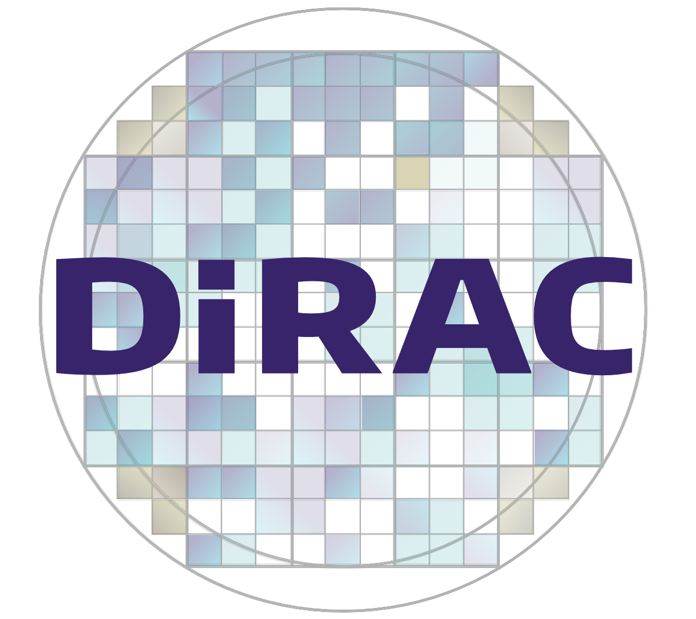
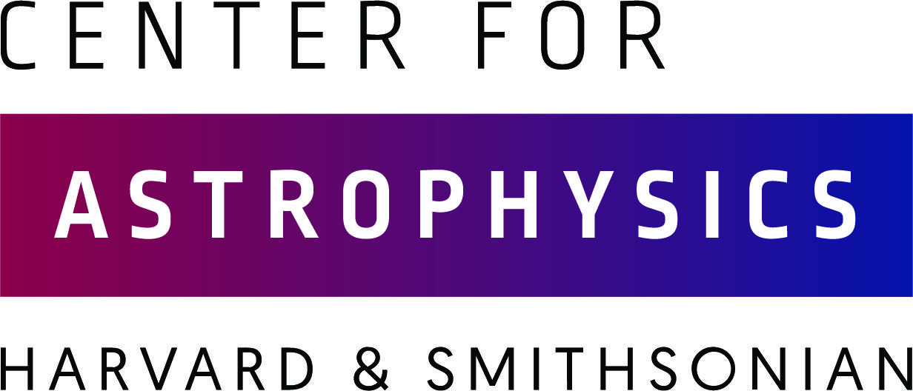

Acknowledgements
================

This effort is a collaboration between Queen's University Belfast, the University of Washington's DiRAC Institute, the University of Illinois Urbana-Champaign, the Center for Astrophysics | Harvard & Smithsonian, and LINCC Frameworks (through the LINCC Frameworks Incubator Program).

.. image:: images/QUBLogo.png
  :width: 210
  :alt: Queen's University Belfast logo

.. image:: images/WashingtonLogo.png
  :width: 190
  :alt: University Washington Logo

Sorcha development was supported in part by:

- Science and Technology Facilities Council (STFC) grants ST/P000304/1 and ST/V000691/1
- Horizon 2020 Marie Skłodowska-Curie Postdoctoral Fellowship
- Preparing for Astrophysics with LSST Program, funded by the Heising Simons Foundation through grant 2021-2975, and administered by Las Cumbres Observatory 
- LINCC Frameworks is supported by Schmidt Futures, a philanthropic initiative founded by Eric and Wendy Schmidt, as part of the Virtual Institute of Astrophysics (VIA)
