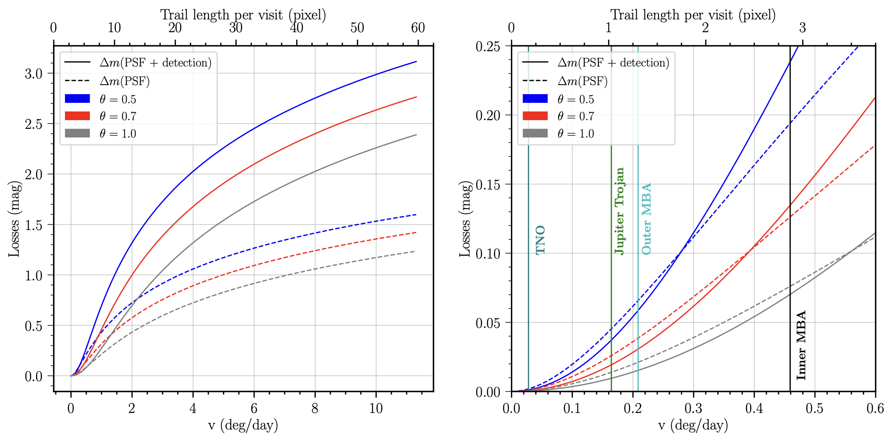

.. _apparent_magnitudes

Post-Processing (Applying Survey Biases)
==========================================================

Trailed Source Magnitude and PSF (Point Spread Function) Magnitude
---------------------------------------------------------------------

``Sorcha`` calculates two apparent magnitudes that we will refer to as the **trailed source magnitude** and the **PSF magnitude**. 

.. image:: images/trailed_source.png
  :width: 500
  :alt: A cartoon explanation of trailed source mag and PSF mag
  :align: center

Phase Curves
------------------------------------------------------------

.. _addons:

Incorporating Rotational Light Curves and Activity
------------------------------------------------------------
``Sorcha`` has the ability user provided functions though python classes that augment/change the apparent brightness calculations for the synthetic Solar System objects. Any values required as input for these calculations, must be provided in the separate :ref:`CPP` file as input. 

We have base example classes that the user can take and modify to whatever your need is. Within the ``Sorcha`` :ref:`configs`, the user would then specify which class they want to use and provide the required :ref:`CPP` file on the command line. 

Once the Sorcha addons is installed, Sorcha will automatically detect the available plugins and make them available during processing.

To use one of the plugins from the community utilities, simply add the unique name of the plugin to the configuration file provided to Sorcha, and provide the complex parameters file on the command line.

 We also have 2 pre-made example classes that can augment the calculated apparent magnitude of each synthetic object, One for handling cometary activity as a function of heliocentric distance and one that applies rotational light curves to the synthetic objects. In both cases, any derived class must inherit from the corresponding base class and follow its API, to ensure that Sorcha knows how to find and use your class.

Cometary Activity or Simulating Other Active Objects
~~~~~~~~~~~~~~~~~~~~~~~~~~~~~~~~~~~~~~~~~~~~~~~~~~~~~~~~

.. literalinclude:: ../src/sorcha/activity/base_activity.py
   :language: python

Through the ``Sorcha'' configuration file. 

lsst_comet

.. seealso::
  We have an `example Jupyter notebook <notebooks/demo_Cometary_Activity.ipynb>`_  demonstrating the LSSTCometActivity class built into `Sorcha addons  GitHub repository <https://github.com/dirac-institute/sorcha-addons>`_.  

You can also develop your own class to apply a different comentary activity and add it into a custom version of the``Sorcha addons`` package.  Once the Sorcha-addons is installed, Sorcha will automatically detect the available plugins and make them available during processing.

Rotational Light Curve Effects
~~~~~~~~~~~~~~~~~~~~~~~~~~~~~~~~~~~~~
The base lightcurve class is `AbstractLightCurve <https://github.com/dirac-institute/sorcha/blob/04baa79a7d67e1647b839a2d3880d8bfd9ce4624/src/sorcha/lightcurves/base_lightcurve.py#L10>`_ (see below). Inside the `Sorcha addons  GitHub repository <https://github.com/dirac-institute/sorcha-addons>`_, we provide a simple example implementation where the apparent magnitude of the object (that is, the magnitude after all geometric effects have been taken into account), has a sinusoidal term added to it. To use this function, in the :ref:`CPP` file, the user must provide a light curve amplitude (`LCA`), corresponding to half the peak-to-peak amplitude for the magnitude changes, a period `Period`, and a reference time `Time0` where the light curve is at 0 - if these are not provided, the software will produce an error message. Despite being simple, that implementation shows all the class methods that need to be implemented for a custom light curve function.

.. literalinclude:: ../src/sorcha/lightcurves/base_lightcurve.py
   :language: python

.. seealso::
  We have an `example Jupyter notebook <notebooks/demo_Lightcurve.ipynb>`_  demonstrating the SinusoidalLightCurve class built into `Sorcha addons  GitHub repository <https://github.com/dirac-institute/sorcha-addons>`_, 

Applying Photometric and Astrometric Uncerainties 
------------------------------------------------------------

Trailing Losses
-----------------

If the observed object is fast-moving, the signal will form a trail, reducing the measured magnitude.
This filter will recalculate the PSF magnitude of the observations, adjusting for trailing losses.

Accounting for Saturation (Saturation/Bright Filter) 
------------------------------------------------------------

The saturation limit filter removes all detections that are brighter than the saturation limit
of the survey. `Ivezić et al. (2019) <https://ui.adsabs.harvard.edu/abs/2019ApJ...873..111I/abstract>`_
estimate that the saturation limit for the LSST will be ~16 in the r filter. 

``Sorcha`` includes functionality to specify either a single saturation limit, or a saturation limit in each filter.
For the latter, limits must be given in a comma-separated list in the same order as the filters supplied 
for the observing_filters config file variable.

To include this filter, the configuration file should contain::

    [SATURATION]
    bright_limit = 16.0

Or::

    [SATURATION]
    bright_limit = 16.0, 16.1, 16.2

.. note::
  The saturation filter is only applied if the :ref:`configuration file<configs>` has a SATURATION section. 
