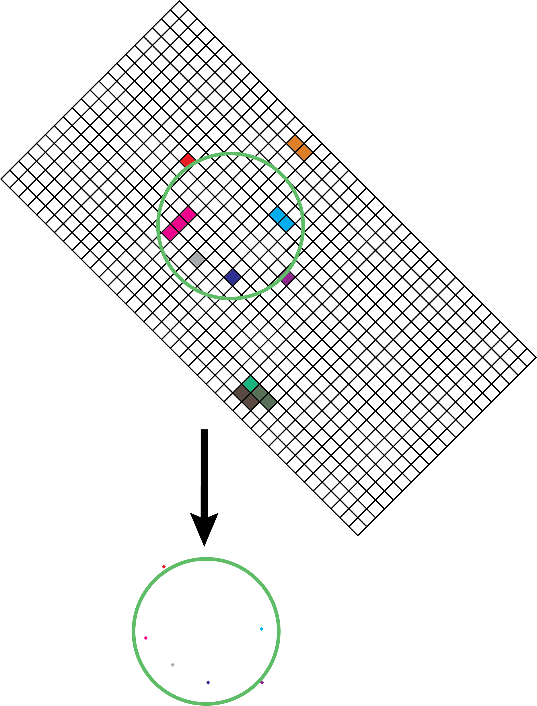

.. _ephemeris_gen:

Ephemeris Generator
==========================================================

Sorcha's ephemeris generator is powered by `ASSIST  <https://assist.readthedocs.io/en/latest/>`__, a software package for ephemeris-quality integrations of test particles, and the `REBOUND <https://rebound.readthedocs.io/en/latest/>`__ N-body integration package. If the user prefers to use a different generator or provide the ephemeris output from a previous Sorcha run,  they have the ability to point Sorcha to an external file to ingest instead.

.. tip::
  We recommend using Sorcha's ephemeris generator for all your survey simulations. 

How It Works
--------------------------------------------------------

The Sorcha ephemeris generator determines which objects will appear in or near the camera field-of-view (FOV) for any given exposure.  It uses spatial indexing to speed up these calculations.  It runs through the survey visits and does on-the-fly checks of where every synthetic object is near the center of each night for which there are visits and organizes those positions using the `HEALPix (Hierarchical Equal Area isoLatitude Pixelation of a sphere) <https://healpix.sourceforge.io/>`_ tesselation of the sky.  Given that information, it then steps through the visits for that night, doing precise calculations for just those objects that are near the camera FOV of each survey on-sky visit. Specifically, for each visit, the generator calculates the unit vector from the observatory's location to the RA/Dec location of the field center. Then it finds the  set of HEALPix tiles that are overlapped by the survey visit's camera FOV (nside=64). The ephemeris generator then collects the IDs for the particles in the HEALPix tiles overlapped by the given survey visit FOV.  It then does light-time-corrected ephemeris calculations for just those, outputting the right ascension, declination, rates, and relevant distances, and phase angle values for each of the particles. 

A cartoon schematic of ephemeris generation within Sorcha for a patch of sky and a single survey observation is shown below. Each box represents a healpixel in the HEALpix grid on the sky. The colored healpixels are where  different Solar System objects is estimated to cover during some part of the night (based on their speed and velocity vector on sky they will be in one or more healpixels) based on the rough calculation from Sorcha. The midnight position and 2 other positions during each night are calculated for each simulated small body. Using interpolation, all the healpixels that the object passes through in the evening are identified. In the figure, each color represents a different moving object on a different orbit. Slower moving objects will cover less healpixels. The green circle represents an area slightly bigger than the survey's camera footprint. For the given observation time, any orbits with healpixels within the circle are integrated to calculate their exact positions at the time of the observation. Those orbits that land within the circle are then identified and the resulting ephemerides associated with those objects and the observation are saved. 

Because ASSIST uses REBOUND's `IAS15 integrator <https://ui.adsabs.harvard.edu/abs/2015MNRAS.446.1424R/abstract>`_, which has an adaptive time step, Sorcha's ephemeris generator instantiates a REBOUND n-body simulation for each individual massless synthetic object including the effects of the Sun, planets, Moon, and 16 asteroids (see the :ref:`MAP` section). It also includes the J2, J3, and J4 gravitational harmonics of the Earth, the J2 gravitational harmonic of the Sun, and general relativistic correction terms for the Sun, using the Parameterized Post-Newtonian (PPN) formulation. The positions of the massive bodies come from the latest `DE441 <https://iopscience.iop.org/article/10.3847/1538-3881/abd414>`_ ephemeris, provided by NASA's `Navigation and Ancillary Information Facility (NAIF) <https://naif.jpl.nasa.gov/naif/credit.html>`_. We note that the coordinate frame for ASSIST+REBOUND  is the equatorial International Celestial Reference Frame (ICRF).  The positions and velocities are barycentric within this frame, rather than heliocentric. The ephemeris generator translates the input barycentric or heliocentric orbits into x,y, z and velocities into the barycentric ICRF to be read into ASSIST. 

.. tip::
  If using Sorcha's internal ephemeris generation mode (which is the default mode), **we recommend calculating/creating your input orbits with epochs close in time to the start of the first survey observation**. This will minimize the REBOUND n-body integrations required to set up the ephemeris generation.

.. tip::
  For further details, we recommend you read the `ASSIST <https://ui.adsabs.harvard.edu/abs/2023PSJ.....4...69H/abstract>`__ and `REBOUND <https://ui.adsabs.harvard.edu/abs/2012A%26A...537A.128R/abstract>`__ papers. 

.. _MAP:

Massive Asteroid Perturbers
--------------------------------------------------------
Here's the list of asteroid pertubers that are included in the ASSIST+REBOUND integrations.

- **(107) Camilla = A868 WA = 1886 WA**
- **(1) Ceres = A801 AA** 
- **(65) Cybele = A861 EB** 
- **(511) Davida = A903 KB**
- **(15) Eunomia = A851 OA**
- **(31) Euphrosyne = A854 RA**
- **(52) Europa = A858 CA** 
- **(10) Hygiea = A849 GA**
- **(704) Interamnia = A910 TC**
- **(7) Iris = A847 PA**
- **(3) Juno = A804 RA**
- **(2) Pallas = A802 FA**
- **(16) Psyche = A852 FA** 
- **(87) Sylvia = A866 KA**
- **(88) Thisbe = A866 LA**
- **(4) Vesta = A807 FA** 

.. warning::
  If you simulate the orbits of these select asteroids you will get **POOR results** with the internal Sorcha ephemeris generator because of how the n-body integration is set up. We recommend getting the positions of these asteroids from some other source and inputting them as an external ephemeris file. 

.. _tuneem:

Tuning the Ephemeris Generator
-----------------------------------

There are several tunable options for the ephemeris generation which are described below that are set by the Sorcha :ref:`configs`.

- Minor Planet Center (MPC) observatory code for the provided telescope (**ar_obs_code** configuration parameter)
- Field of view of our search field (in degrees) (**ar_ang_fov** configuration parameter)
- Buffer zone around the field of view we want to include (in degrees) (**ar_fov_buffer** configuration parameter)
- Picket length (in days) (**ar_picket** configuration parameter) 
- Order of healpix used by healpy (*ar_healpix_order** configuration parameter)

To use Sorcha's internal ephemeris generation engine, the configuration file should contain::

   [INPUT]
   ephemerides_type = ar

   [SIMULATION]
   ar_ang_fov = 2.06
   ar_fov_buffer = 0.2
   ar_picket = 1
   ar_obs_code = X05
   ar_healpix_order = 6

.. tip::
   We recommend you use the above default values which we also use in our :ref:`example_configs`, as they are sufficient for most Solar System populations you'll want to simulate for LSST observations. For further details about these default values, we refer the reader to the :ref:`Footprint filter<the_camera_footprint>` discussion.

Required Auxiliary Files 
---------------------------

A number of auxiliary files available from the `Minor Planet Center <https://www.minorplanetcenter.net/data>`_ and  `NASA's Navigation and Ancillary Information Facility (NAIF) <https://naif.jpl.nasa.gov/pub/naif/generic_kernels/>`_ are required for ephemeris generation:

- **naif0012.tls** is the leap second file. This changes whenever there is a new leap second. The last was in 2017.
- **earth_720101_070426.bpc** is the historical Earth orientation specification. This should not change, unless there is a new model.
- **earth_200101_990628_predict.bpc** is a prediction of the Earth's future orientation. Likewise, this should not change.
- **pck00010.tpc** contains orientation information and physical constants for other bodies. This should only change rarely.
- **de440s.bsp** gets used for getting the Earth's position for ephemerides.
- **earth_latest_high_prec.bpc** is a regularly updated specification of the Earth's orientation, refined as new observations are incorporated.
- **obscodes_extended.json** - observatory position information and Minor Planet Center (MPC) observatory codes.

.. tip::
  See our :ref:`installation_aux` instructions to find out how to download and install these auxiliary files automatically using our download utility. 

Saving the Output From the Ephemeris Generator
------------------------------------------------

If you want to use the same input orbits across multiple Sorcha runs, you can save time by outputting the output from the ephemeris generation stage using the command line flag **-ew** in combination with a stem filename (do not include the file extension). Then in subsequent runs you will need to use the **-er** flag to on the command line to specify the input ephemeris file to read in. You will also need to remove :ref:`the ephemeris generation parameters<tuneem>` from the configuration file and add the following::

   [INPUT]
   ephemerides_type = external
   eph_format = csv

**eph_format** is the format of the output ephemeris file. Options are **csv**, **whitespace**, and **hdf5**. 

.. attention::
   Currently the Sorcha-generated ephemeris is outputted in CSV, whitespace or HDF5 file format only.

Providing Your Own Ephemerides 
---------------------------------

If you prefer to use a different method or software package for producing the ephemerides of your input orbits, you can provide an input file on the command line. Further details be found on the :ref:`Inputs page<ephemf>`. You will also need to set up the configuration file as::

   [INPUT]
   ephemerides_type = external
   eph_format = csv

**eph_format** is the format of the user provided ephemeris file. Options are **csv**, **whitespace**, and **hdf5**. 

.. tip::
   Use the **-er** flag on the command line to specify the external ephemeris file that Sorcha should use. 

.. warning::
   We have validated and tested Sorcha and its internal ephemeris generator. If the user decides to use a different method to provide the required ephemerides for their science, it is up to the user to validate/check the output of the external ephemeris generator. 
