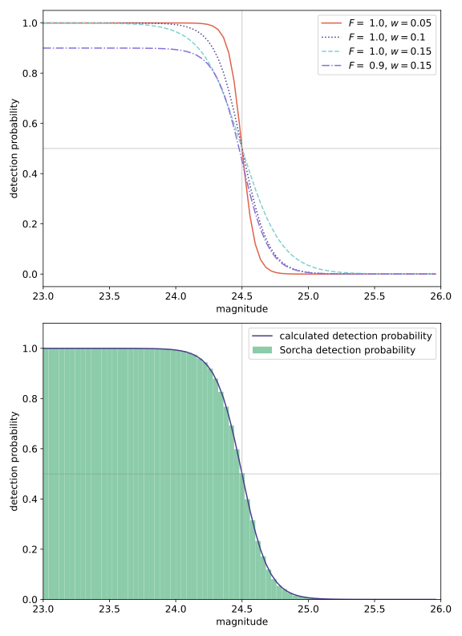
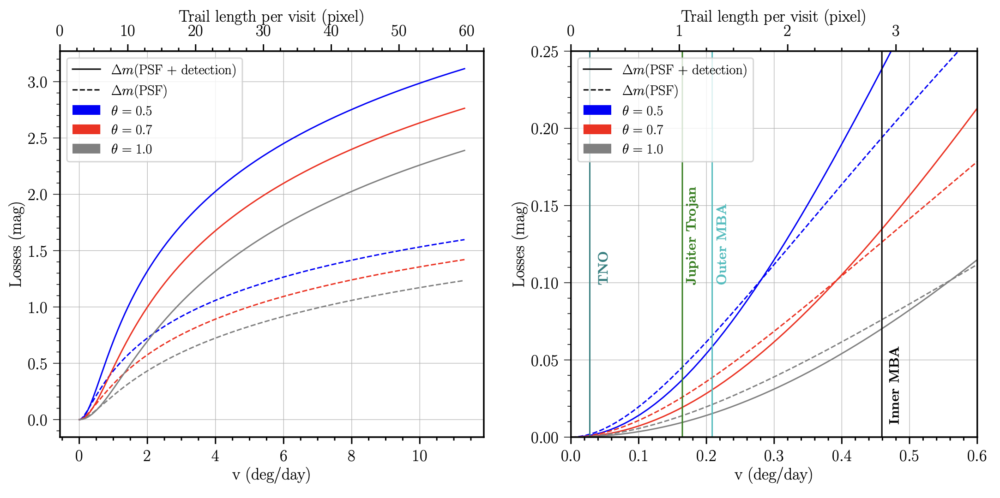
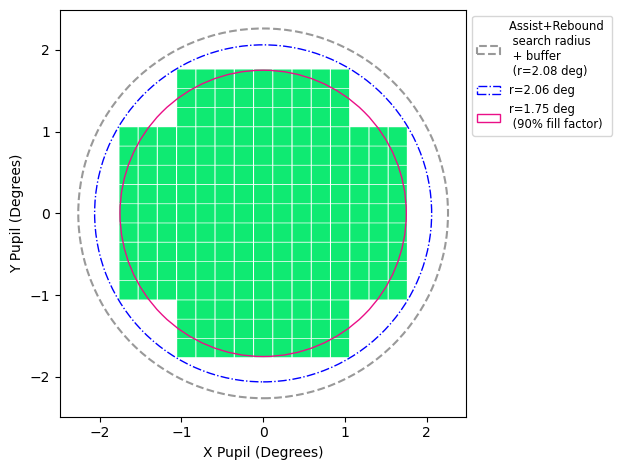
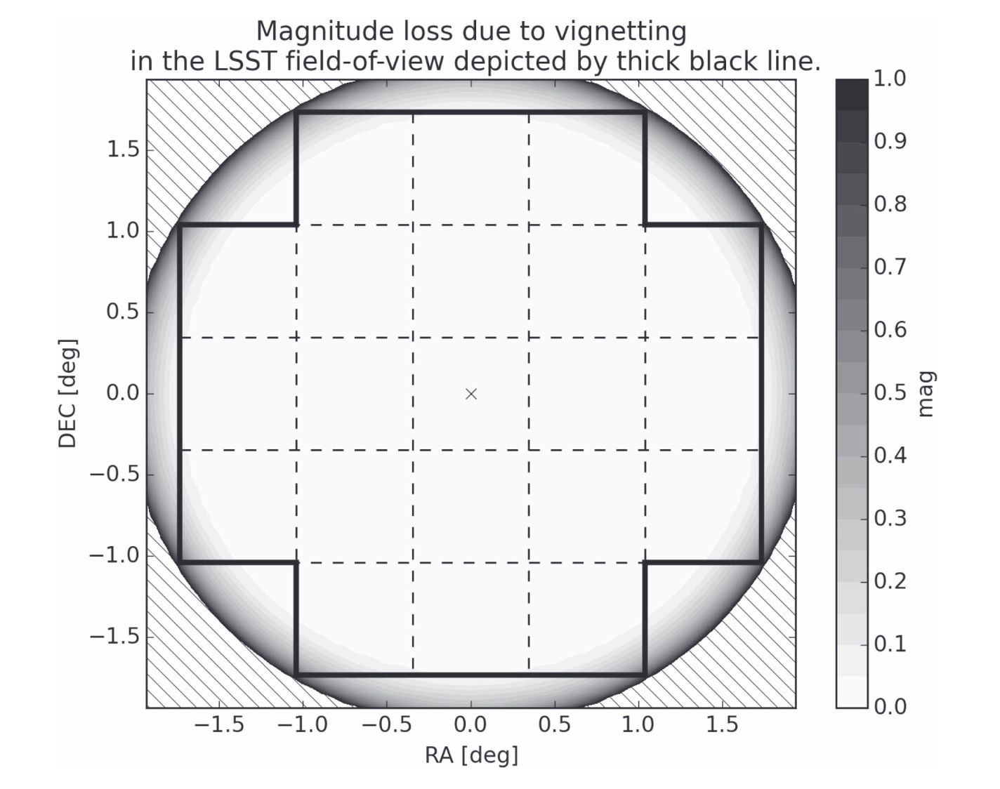

.. _filters:

Sorcha's Filter Options
========================================

Below are the user-controlled filters applied by Sorcha with the relevant configuration
file parameters and suggested/example values.

.. tip::
    For a more in-depth explanation of these filters and how they are implemented,
    please see our upcoming paper (Merritt et al. in prep).

Brightness/Saturation Limit
---------------------------

The saturation limit filter removes all detections that are brighter than the saturation limit
of the survey. `Ivezić et al. (2019) <https://ui.adsabs.harvard.edu/abs/2019ApJ...873..111I/abstract>`_
estimate that the saturation limit for the LSST will be ~16 in the r filter. 

Sorcha includes functionality to specify either a single saturation limit, or a saturation limit in each filter.
For the latter, limits must be given in a comma-separated list in the same order as the filters supplied 
for the observing_filters config file variable.

To include this filter, the configuration file should contain::

    [SATURATION]
    bright_limit = 16.0

Or::

    [SATURATION]
    bright_limit = 16.0, 16.1, 16.2

Fading Function/Detection Efficiency
------------------------------------

This filter serves to remove observations of objects which are faint beyond the survey's capability
to detect them. Sorcha uses the fading function formulation of `Veres and Chesley (2017) <https://ui.adsabs.harvard.edu/abs/2017arXiv170506209C/abstract>`_:
see the below plot. This fading function is parameterised by the fading function width and peak efficiency. 
The default values are modelled on those from the aforementioned paper.

To include this filter, the following options should be set in the configuration file::

    [FADINGFUNCTION]
    fading_function_on = True
    fading_function_width = 0.1
    fading_function_peak_efficiency = 1.

Trailing Losses
-----------------

.. warning::
    We **very strongly recommend** that the user never turn this off, but we provide 
    this option for debugging or for speed increases when the user is absolutely sure 
    they are only supplying slow-moving objects.

If the observed object is fast-moving, the signal will form a trail, reducing the measured magnitude.
This filter will recalculate the PSF magnitude of the observations, adjusting for trailing losses.

The trailing losses filter is on by default, but it can be turned off by including the option in the configuration file::

    [EXPERT]
    trailing_losses_on = False

Camera Footprint
-----------------

.. attention::
    Applying some form of the camera footprint filter is mandatory: the config file must include the `camera_model` keyword and
    at least one of the additional variables as shown below.

Due to the footprint of the LSST detector (see figure below), it is possible that some objects may be lost in
gaps between the chips. The LSST detector shape is included in the repo and described by the file `./data/detector_corners.csv`. 

However, the full camera footprint is most relevant for slow-moving objects, where an 
object may move only a small amount per night and could thus in a subsequent observation fall into a chip gap. This is less concerning for 
faster-moving objects such as asteroids and NEOs. 

As a result, we provide three methods of applying the camera footprint.

**Simple sensor area:** Using this filter removes random observations to roughly mimic the chip gaps. The
fraction of observations not removed is controlled by the config variable fill_factor. To include this filter, the following 
options should be set in the configuration file::

    [FOV]
    camera_model = circle
    fill_factor = 0.9

**Circle radius:** Using this filter applies a very simple circular camera footprint. The radius of the circle should
be given in degrees. To include this filter, the following options should be set in the configuration file::

    [FOV]
    camera_model = circle
    circle_radius = 1.8

.. warning::
    Note that ASSIST+REBOUND also uses a circular radius for its search area, with a default of 2.06.
    Setting circle_radius to be larger than the radius used for ASSIST+REBOUND will have no effect. 

**Camera footprint:** Using this filter applies a full camera footprint, including chip gaps. This is the 
slowest and most accurate version of the footprint filter.

To include this filter, the following options should be set in the configuration file::

    [FOV]
    camera_model = footprint
    footprint_path = ./data/detectors_corners.csv

Additionally, the camera footprint can model losses at the edge of the detectors at a threshold measured in arcseconds on 
the focal plane using the `footprint_edge_threshold` key: omitting this key omits this functionality. Include::

    [FOV]
    camera_model = footprint
    footprint_path = ./data/detectors_corners.csv
    footprint_edge_threshold = 0.0001

Vignetting
-----------------
Objects that are on the edges of the field of view are dimmer due to vignetting: the field-of-view is not
uniformly illuminated, and so the limiting magnitude for each detection will depend on its position within the FOV.
This filter applies a model of this from a built-in function tailored specifically for the LSST (see 
`Araujo-Hauck et al. 2016 <https://ui.adsabs.harvard.edu/abs/2016SPIE.9906E..0LA/abstract>`_, with further
discussion and below figure from `Veres and Chesley 2017 <https://ui.adsabs.harvard.edu/abs/2017arXiv170506209C/abstract>`_.) 

Vignetting is applied by default and cannot be turned off by the user in the config file.

SNR/Magnitude Limits
---------------------

These two mutually-exclusive filters serve to cut observations of faint objects. 
The user may either implement the SNR limit, to remove all observations of objects
below a user-defined SNR threshold; or the magnitude limit, to remove all observations
of objects above a user-defined magnitude.

To implement the SNR limit, include the following in the config file::

    [EXPERT]
    SNR_limit = 2.0
    
To implement the magnitude limit, include the following in the config file::

    [EXPERT]
    magnitude_limit = 22.0

.. attention::
    Only one of these filters may be implemented at once.

Linking 
---------------------------

The linking filter simulates the behaviour of LSST's Solar System Processing (SSP, `Jurić et al. 2020 <https://lse-163.lsst.io/>`_,
`Swinbank et al. 2020 <https://docushare.lsst.org/docushare/dsweb/Get/LDM-151>`_), the automated software pipeline 
dedicated to linking and cross-matching observations that belong to the same object.

Linking is performed by detecting multiple observations of an object in a single night: a 'tracklet'. 
A number of these tracklets must then be detected in a specific time window
to form a 'track'.

To use this filter, the user must specify all six of the parameters in the configuration file.
The defaults given below are those used by SSP and are explained in the comments::

    [LINKING]

    # Not all objects will be linked by SSP: this variable controls the 
    # fraction successfully linked.
    SSP_detection_efficiency = 0.95

    # The number of observations required to form a valid tracklet.
    SSP_number_observations = 2

    # The minimum separation (in arcsec) between two observations of 
    # an object required for the linking to distinguish them as separate.
    SSP_separation_threshold = 0.5

    # The maximum time separation (in days) between subsequent 
    # observations in a tracklet.
    SSP_maximum_time = 0.0625

    # The number of tracklets required to form a track.
    SSP_number_tracklets = 3

    # Tracklets must occur in <= this number of days to constitute a
    # complete track/detection.
    SSP_track_window = 15

 
