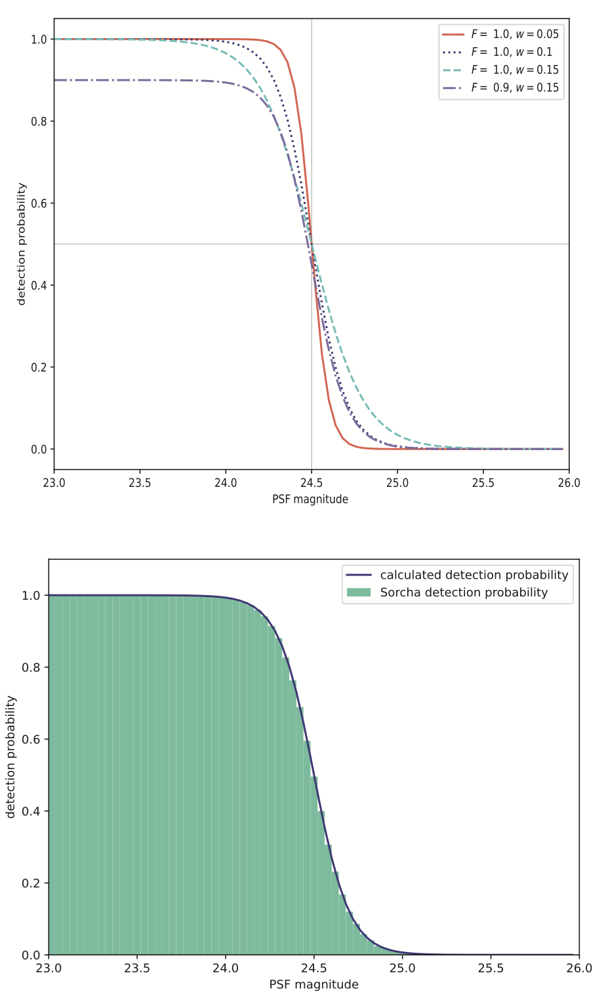

.. _filters:

Sorcha's Filter Options
========================================

Below are the user-controlled filters applied by Sorcha with the relevant configuration
file parameters and suggested/example values.

.. tip::
    For a more in-depth explanation of these filters and how they are implemented,
    please see our upcoming paper (Merritt et al. in prep).

Brightness/Saturation Limit
---------------------------

The saturation limit filter removes all detections that are brighter than the saturation limit
of the survey. `Ivezić et al. (2019) <https://ui.adsabs.harvard.edu/abs/2019ApJ...873..111I/abstract>`_
estimate that the saturation limit for the LSST will be ~16 in the r filter. 

Sorcha includes functionality to specify either a single saturation limit, or a saturation limit in each filter.
For the latter, limits must be given in a comma-separated list in the same order as the filters supplied 
for the observing_filters config file variable.

To include this filter, the configuration file should contain::

    [SATURATION]
    bright_limit = 16.0

Or::

    [SATURATION]
    bright_limit = 16.0, 16.1, 16.2

Fading Function/Detection Efficiency
------------------------------------

This filter serves to remove observations of objects which are faint beyond the survey's capability
to detect them. Sorcha uses the fading function formulation of `Veres and Chesley (2017) <https://ui.adsabs.harvard.edu/abs/2017arXiv170506209C/abstract>`_:
see the below plot. This fading function is parameterised by the fading function width and peak efficiency. 
The default values are modelled on those from the aforementioned paper.

To include this filter, the following options should be set in the configuration file::

    [FADINGFUNCTION]
    fading_function_on = True
    fading_function_width = 0.1
    fading_function_peak_efficiency = 1.

.. _the_camera_footprint:

Camera Footprint
-----------------

.. attention::
    Applying some form of the camera footprint filter is mandatory.

Due to the footprint of the LSST Camera (LSSTCam), see the figure below, it is possible that some object detections  may be lost in
gaps between the chips. 

.. image:: images/Footprint.png
  :width: 600
  :alt: Plot of the LSST camera footprint where x and y are x and y distance from the pupil in degrees. The footprint also shows two overplotted circle radii of 1.75deg (corresponding to a 75% fill factor) and 2.06deg.
  :align: center

However, the full camera footprint is most relevant for slow-moving objects, where an object may move only a small amount per night and could thus in a 
subsequent observation fall into a chip gap. This is less concerning for faster-moving objects such as asteroids and near-Earth objects. As a result, 
we provide two methods of applying the camera footprint.

Circle Radius (Simple Sensor Area)
~~~~~~~~~~~~~~~~~~~~~~~~~~~~~~~~~~~~~~~

Using this filter applies a very simple circular camera footprint. The radius of the circle (**circle_radius** key) should
be given in degrees. The **fill_factor** key specifics what fraction of observations should be randomly removed to roughly mimic detector chip
 gaps in this circular footprint approximation. The fraction of observations not removed is controlled by the config variable fill_factor. 
To include this filter, the following options should be set in the configuration file::

    [FOV]
    camera_model = circle
    circle_radius = 1.75
    fill_factor = 0.9

.. warning::
    Note that :ref:`ASSIST+REBOUND ephemeris generator<ephemeris_gen>` also uses a circular radius for its search area. To get accurate results, the ASSIST+REBOUND radius must be set to be larger than the circle_radius. For simmulating the LSST, we rcommend setting **ar_ang_fov = 2.06** and **ar_fov_buffer = 0.2**. Setting the circle_radius to be larger than the radius used for ASSIST+REBOUND will have no effect. 

.. tip::
   For Rubin Observatory, the circle radius should be set to 1.75 degrees with a fill factor of 0.9 to approximate the detector area of LSSTCam.

.. _full_camera_footprint:

Full Camera Footprint
~~~~~~~~~~~~~~~~~~~~~~~

Using this filter applies a full camera footprint, including chip gaps. This is the slowest and most accurate version of the footprint filter.

To include this filter, the following options should be set in the configuration file::

    [FOV]
    camera_model = footprint
    footprint_path = ./data/detectors_corners.csv

.. tip::
    Sorcha comes with a representation of the LSSTCam footprint already installed. If you do not include the **footprint_path** in the configuration file, then Sorcha assumes you're using its internal LSSTCam footprint. 

.. warning::
    Note that :ref:`ASSIST+REBOUND ephemeris generator<ephemeris_gen>` uses a circular radius for its search area. To get accurate results, the ASSIST+REBOUND radius must be set to be larger than the circle_radius. For simmulating the LSST, we rcommend setting **ar_ang_fov = 2.06** and **ar_fov_buffer = 0.2**.  

Additionally, the camera footprint  model can account for the losses at the edge of the CCDs where the detection software will not be able to pick out sources close to the edge. You can add an exclusion zone around each CCD measured in arcseconds (on the focal plane) using the `footprint_edge_threshold` key to the configuraiton file.  An example setup in the configuration file::

    [FOV]
    camera_model = footprint
    footprint_path = ./data/detectors_corners.csv
    footprint_edge_threshold = 0.0001

.. tip::
    Sorcha comes with a representation of the LSSTCam footprint already installed. If you do not include the **footprint_path** in the configuration file, then Sorcha assumes you're using its internal LSSTCam footprint.

Vignetting
-----------------
Objects that are on the edges of the field of view are dimmer due to vignetting: the field-of-view is not
uniformly illuminated, and so the limiting magnitude for each detection will depend on its position within the FOV.
This filter applies a model of this from a built-in function tailored specifically for the LSST (see 
`Araujo-Hauck et al. 2016 <https://ui.adsabs.harvard.edu/abs/2016SPIE.9906E..0LA/abstract>`_, with further
discussion and below figure from `Veres and Chesley 2017 <https://ui.adsabs.harvard.edu/abs/2017arXiv170506209C/abstract>`_.) 

Vignetting is applied by default and cannot be turned off by the user in the config file.

.. _linking:

Linking 
---------------------------

The linking filter simulates the behaviour of LSST's Solar System Processing (SSP, `Jurić et al. 2020 <https://lse-163.lsst.io/>`_,
`Swinbank et al. 2020 <https://docushare.lsst.org/docushare/dsweb/Get/LDM-151>`_), the automated software pipeline 
dedicated to linking and cross-matching observations that belong to the same object.

Linking is performed by detecting multiple observations of an object in a single night: a 'tracklet'. 
A number of these tracklets must then be detected in a specific time window
to form a 'track'.

To use this filter, the user must specify all seven of the parameters in the configuration file.
The defaults given below are those used by SSP and are explained in the comments::

    [LINKING]

    # Not all objects will be linked by SSP: this variable controls the 
    # fraction successfully linked.
    SSP_detection_efficiency = 0.95

    # The number of observations required to form a valid tracklet.
    SSP_number_observations = 2

    # The minimum separation (in arcsec) between two observations of 
    # an object required for the linking to distinguish them as separate.
    SSP_separation_threshold = 0.5

    # The maximum time separation (in days) between subsequent 
    # observations in a tracklet.
    SSP_maximum_time = 0.0625

    # The number of tracklets required to form a track.
    SSP_number_tracklets = 3

    # Tracklets must occur in <= this number of days to constitute a
    # complete track/detection.
    SSP_track_window = 15
    
    # The time in UTC at which it is noon at the observatory location (in standard time).
    # For the LSST, 12pm Chile Standard Time is 4pm UTC.
    SSP_night_start_utc = 16.0

By default, when the linking filter is on, Sorcha will drop all observations of unlinked objects. If the user wishes to retain
these observations, this can be set in the configuration file. This will add an additional column to the output, **object_linked**, which states whether
the observation is of a linked object or not. To enable this functionality, add the following to the configuration file::

    [LINKING]
    drop_unlinked = False

Expert Filters
----------------------

SNR/Apparent Magnitude Cuts
~~~~~~~~~~~~~~~~~~~~~~~~~~~~~~~

.. warning::
    These filters are for the advanced user. If you only want to know what the survey will discover, you **DO NOT** need these filters on. 

These two mutually-exclusive filters serve to cut observations of faint objects.
The user may either implement the SNR limit, to remove all observations of objects
below a user-defined SNR threshold; or the magnitude limit, to remove all observations
of objects above a user-defined magnitude.

To implement the SNR limit, include the following in the config file::

    [EXPERT]
    SNR_limit = 2.0

To implement the magnitude limit, include the following in the config file::

    [EXPERT]
    magnitude_limit = 22.0

.. attention::
    Only one of these filters may be implemented at once.
 
