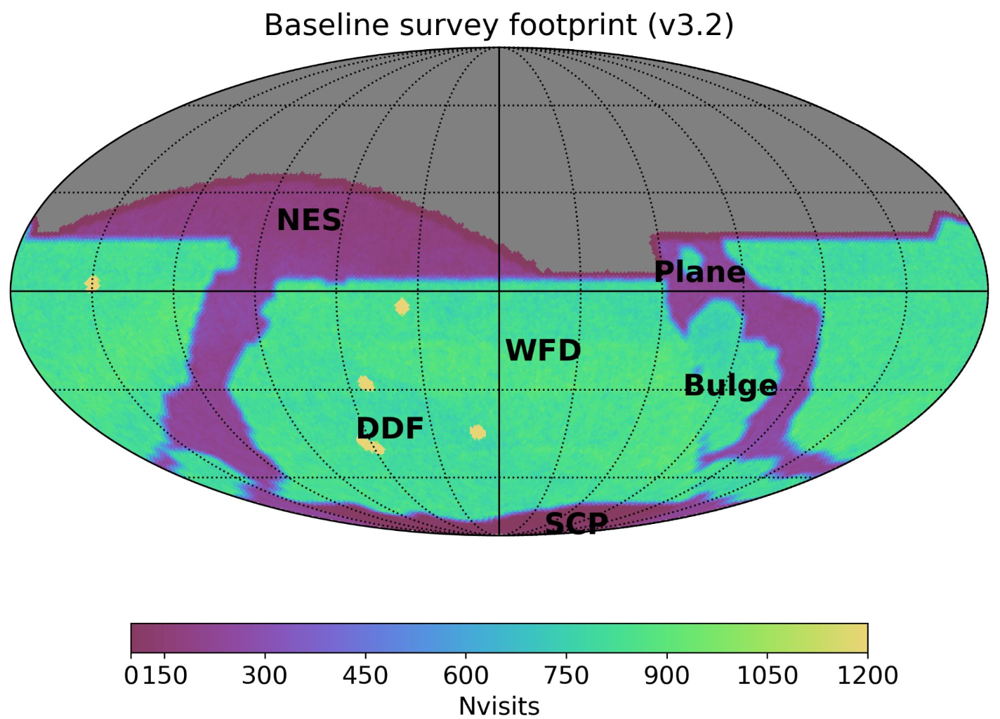

.. _inputs:

Inputs
==========

.. note::
  The user must specify the properties of each synthetic planetesimal individually: an orbit, other physical parameters (like color, absolute magnitude, phase curve parameters, etc), and, optionally if needed, complex physical parameters and the computer ephemeris.

There is a set of input files that are required to run the Sorcha codes, which describe the orbital
and physical parameters for synthetic planetesimals that are being simulated. These files are: an orbit file, a physical parameter file,the LSST pointing database, and optionally, an ephemeris file with positions of where the simulated particles are located within some distance of the survey field poitings, and a complex parameter file for more advanced handling of rotational light curves and other brightness enhancements (such as due to cometary activity) . Each of these files are described within this section and example files are shown.

.. image:: images/survey_simulator_flow_chart.png
  :width: 800
  :alt: An overview of the inputs and outputs of the Sorcha code.

.. tip::
  Each synthetic planetesimal has its own unique object identifier set by the user and must have entries in the orbits and physical parameters files, as well as the cometary activity file, if used.

.. warning::
  Sorcha is not checking whether or not a planetesimal ID has been repeated in another row of the input files. **It is up to the user to ensure their input files include only unique IDs**.

.. _orbits:

Orbit File
-----------------

This is a file which contains the orbital information of a set of synthetic objects.

.. tip::
  *  Sorcha is **only** designed to handle **Cometary (COM), Keplerian (KEP), and Cartesian (CART)** orbits
  *  The orbit file **must** have a consistent format (i.e. Cometary or Keplerian or Cartesian) throughout
  *  The ordering of the columns does not matter as long as the required columns exist and have entries
  *  The first row in the orbit file **must** be a header listing the columns names
  *  The **correct capitalization of column names** is required
  *  The orbit file can be either **white space separated** or **comma value separated (CSV)**
  *  Each simulated particle **must** have a unique string identifier
  *  The orbit file **must only** have 9 columns (object identifier, format column, 6 orbital parameters, and a time epoch)

.. warning::
  Sorcha assumes **heliocentric** orbits are provided as input!

.. warning::
  The orbit epoch is expected to be given in **TDB (Barycentric Dynamical Time)**

.. tip::
  If using Sorcha's internal ephemeris generation mode (which is the default mode), **we recommend calculating/creating your input orbits with epochs close in time to the start of the first survey observation**. This will minimize the n-body integrations required to set up the ephemeris generation.

.. note::
  For readability we show examples of white space separated files below.

Cometary Orbit Format
~~~~~~~~~~~~~~~~~~~~~~~
An example of an orbit file in Cometary format::

   objID FORMAT q e inc node argPeri t_p_MJD_TDB epochMJD_TDB
   S1000000a COM 3.01822 0.05208 22.56035 211.00286 335.42134 51575.94061 54800.00000
   S1000001a COM 2.10974 0.07518 4.91571 209.40298 322.66447 54205.77161 54800.00000
   S1000002a COM 2.80523 0.07777 1.24945 112.52284 139.86858 54468.71747 54800.00000
   S1000003a COM 2.10917 0.13219 1.46615 266.54621 232.24412 54212.16304 54800.00000 
   S1000004a COM 2.17676 0.19949 12.92422 162.14580 192.22312 51895.46586 54800.00000

+-------------+----------------------------------------------------------------------------------+
| Keyword     | Description                                                                      |
+=============+==================================================================================+
| objID       | Object identifier for each synthetic planetesimal simulated (string)             |
+-------------+----------------------------------------------------------------------------------+
| FORMAT      | Orbit format string (COM)  						         |
+-------------+----------------------------------------------------------------------------------+
| q           | Perihelion (au)									 |
+-------------+----------------------------------------------------------------------------------+
| e           | Eccentricity                                                                     |
+-------------+----------------------------------------------------------------------------------+
| inc         | Inclination (degrees)                                                            |
+-------------+----------------------------------------------------------------------------------+
| node        | Longitude of the ascending node (degrees)                                        |
+-------------+----------------------------------------------------------------------------------+
| argPeri     | Argument of perihelion (degrees)                                                 |
+-------------+----------------------------------------------------------------------------------+
| t_p_MJD_TDB | Time of periapsis (years, MJD)                                                   |
+-------------+----------------------------------------------------------------------------------+
| epochMJD_TDB| Epoch (MJD)                                                                      |
+-------------+----------------------------------------------------------------------------------+

Keplerian Orbit Format
~~~~~~~~~~~~~~~~~~~~~~~~
An example of an orbit file in Keplarian format::

   objID FORMAT a e inc node argPeri ma epochMJD_TDB 
   t1 KEP 47.9877 0.0585 11.3584 148.4661 140.4756 308.3244 53157.00 
   t2 KEP 47.7468 0.0552 7.1829 171.9226 55.3728 158.9403 53157.00
   t3 KEP 47.9300 0.3805 3.4292 72.9463 7.0754 84.7860 53157.00 
   t4 KEP 47.6833 0.1973 14.0872 344.2142 167.0238 220.2356 53157.00  
   t5 KEP 47.9356 0.2912 4.3621 306.0908 217.8116 18.7043 53157.00  
   t6 KEP 47.9786 0.2730 2.2425 147.9340 166.6578 327.8996 53157.00  

+-------------+----------------------------------------------------------------------------------+
| Keyword     | Description                                                                      |
+=============+==================================================================================+
| objID       | Object identifier for each synthetic planetesimal simulated (string)             |
+-------------+----------------------------------------------------------------------------------+
| FORMAT      | Orbit format string (KEP)                                                        |
+-------------+----------------------------------------------------------------------------------+
| a           | Semimajor axis (au)                                                              |
+-------------+----------------------------------------------------------------------------------+
| e           | Eccentricity                                                                     |
+-------------+----------------------------------------------------------------------------------+
| inc         | Inclination (degree)                                                             |
+-------------+----------------------------------------------------------------------------------+
| node        | Longitude of the ascending node (degrees)                                        |
+-------------+----------------------------------------------------------------------------------+
| argPeri     | Argument of perihelion (degrees)                                                 |
+-------------+----------------------------------------------------------------------------------+
| ma          | Mean Anomaly (degrees)                                                           |           
+-------------+----------------------------------------------------------------------------------+
| epochMJD_TDB| Epoch (MJD)                                                                      |
+-------------+----------------------------------------------------------------------------------+

Cartesian Orbit Format
~~~~~~~~~~~~~~~~~~~~~~~
An example of an orbit file, in Keplerian format, with the object ID represented by a unique set of numbers::

   ObjID,FORMAT,x,y,z,xdot,ydot,zdot,epochMJD_TDB
   STC001TFa,CART,36.701800449281706,-8.770729364470023,-0.6261488665458296,0.0007155581026554,0.0026593939322716,7.344098975957749e-06,54466.0,36.54594860110992,0.04317
   STC001TGa,CART,-21.58733368378989,43.39783041151296,1.56699314137673,-0.0022005866864537,-0.0008717014384454,-4.735561770155727e-05,54466.0,44.842379308393234,0.11655
   STC001THa,CART,-37.814635799443394,-15.408895634838116,-5.805017616166551,0.0013198883808779,-0.0023982304849102,0.0001541826365505,54466.0,43.31324469003626,0.13135
   STC001TIa,CART,41.24248251296191,-5.652356017018537,2.248705059605729,0.0002800360644183,0.0027490608404251,-2.751096337281987e-05,54466.0,45.1101872463009,0.08356
   STC001TJa,CART,17.40239702643279,34.77710957157372,0.0084291177638708,-0.0026387164932318,0.0010268353976719,-0.0001037528579236,54466.0,41.15242897966045,0.10765
   STC001TKa,CART,-15.182212553033564,31.98846596524726,0.179545295303334,-0.0026490933334786,-0.0013306706378324,0.0001110412982125,54466.0,37.39443807826161,0.05752
   STC001TLa,CART,33.603411395500856,18.87464811210368,-0.6359802780512743,-0.0012855812467388,0.0025081701870071,-2.1885697562103903e-05,54466.0,39.93776165518987,0.05171
   STC001TMa,CART,-35.205151144286006,-21.59643017634877,-6.399036148167812,0.0012861312376887,-0.0023168284708868,-0.0001863582741122,54466.0,41.6549967769547,0.05369
   STC001TNa,CART,-33.79882997522472,-16.266135214977684,-5.221001391031022,0.0013485808895118,-0.0024033901851641,-0.0001051222283375,54466.0,36.890329257623286,0.06274

+-------------+----------------------------------------------------------------------------------+
| Keyword     | Description                                                                      |
+=============+==================================================================================+
| objID       | Object identifier for each synthetic planetesimal simulated (string)             |
+-------------+----------------------------------------------------------------------------------+
| FORMAT      | Orbit format string (CART)                                                       |
+-------------+----------------------------------------------------------------------------------+
| x           | heliocentric distance along the x axis (au)                                      |
+-------------+----------------------------------------------------------------------------------+
| y           | heliocentric distance along the y axis (au)                                      |
+-------------+----------------------------------------------------------------------------------+
| z           | heliocentric distance along the z axis (au)                                      |
+-------------+----------------------------------------------------------------------------------+
| xdot        | Longitude of the ascending node (degrees)                                        |
+-------------+----------------------------------------------------------------------------------+
| ydot        | Argument of perihelion (degrees)                                                 |
+-------------+----------------------------------------------------------------------------------+
| zdot        | Mean Anomaly (degrees)                                                           |
+-------------+----------------------------------------------------------------------------------+
| epochMJD_TDB| Epoch (MJD)                                                                      |
+-------------+----------------------------------------------------------------------------------+

.. note::
   All positions and velocities are in respect to J2000

.. _physical:

Physical Parameters File
-------------------------------------------

The input file for the physical parameters includes information about the objects optical colors, phase curve parameters, and absolute magnitude. The contents of this file are the bare minimum needed to simulate survey detections. For more advanced handling of the apparent magnitude of the synthetic objects including light curve effects and cometary activity,you would also specify values in the complex physical parameters file.

.. tip::
  *  The ordering of the columns does not matter as long as the required columns exist and have entries
  *  The first row in the physical parameters file **must** be a header listing the columns names
  *  The **correct capitalization of column names** is required
  *  The physical parameters file can be either **white space separated** or **comma value separated (CSV)**
  *  Each simulated object **must** have a unique string identifier
  *  You  **must use the same phase curve prescription for all simulated objects**. If you want to use different phase curve prescriptions for different synthetic populations, you will need to run them in separate input files to Sorcha
  *  If the  phase curve function is set to NONE in the configuration value then no phase curve parameters values are required in the physical parameters files.
  *  In the config file you can decide which filters you want have Sorcha run on and specify which filter is the main filter that the absolute magnitude is defined for. You only need to provide colors for those filters specified in the config file.

.. note::
  For readability we show examples of white space separated files below.

An example of the physical parameters file where a single linear slope phase curve parameter is used for all filters::

   objID H u-r g-r i-r z-r y-r GS 
   St500000a 5.63 2.55 0.92 -0.38 -0.59 -0.70 0.15
   St500001a 6.25 2.55 0.92 -0.38 -0.59 -0.70 0.15
   St500002a 6.36 1.72 0.48 -0.11 -0.12 -0.12 0.15
   St500003a 6.67 1.72 0.48 -0.11 -0.12 -0.12 0.15
   St500004a 10.2 1.90 0.58 -0.21 -0.30 -0.39 0.15

An example of the physical parameters file where a HG prescription is specified for each filter::

   objID H u-r g-r i-r z-r y-r Gr Gu Gg Gi Gz Gy
   St500000a 5.63 2.55 0.92 -0.38 -0.59 -0.70 0.15 0.17 0.14 0.19 0.18 0.20
   St500001a 6.25 2.55 0.92 -0.38 -0.59 -0.70 0.15 0.17 0.14 0.17 0.19 0.17
   St500002a 6.36 1.72 0.48 -0.11 -0.12 -0.12 0.15 0.17 0.13 0.17 0.16 0.18
   St500003a 6.67 1.72 0.48 -0.11 -0.12 -0.12 0.15 0.16 0.12 0.20 0.15 0.19
   St500004a 10.2 1.90 0.58 -0.21 -0.30 -0.39 0.15 0.15 0.16 0.15 0.14 0.16

Rubin Observatory will survey the sky in six broadband (optical filters), *u, g, r, i, z, and y* . In the physical parameters file, you will specify the object's absolute magnitude in the main filter (as specified in the config file. usually this is g or r band) and then provide the synthetic planetesimal's color in other filters relative to the main filter.

We have implemented several phase curve paramterizations that can be specified in the config file and the inputted through the physical parameters. **You can either specify one set of phase curve parameters for all filters or specify values for each filter examined by Sorcha.** We are using the  `sbpy <https://sbpy.org/>`_  phase function utilities. The supported options are: `HG <https://sbpy.readthedocs.io/en/latest/api/sbpy.photometry.HG.html#sbpy.photometry.HG>`_, `HG1G2 <https://sbpy.readthedocs.io/en/latest/api/sbpy.photometry.HG1G2.html#sbpy.photometry.HG1G2>`_, `HG12 <https://sbpy.readthedocs.io/en/latest/api/sbpy.photometry.HG12.html#sbpy.photometry.HG12>`_, `linear <https://sbpy.readthedocs.io/en/latest/api/sbpy.photometry.LinearPhaseFunc.html#sbpy.photometry.LinearPhaseFunc>`_ (specified by S in the header of the physical parameters file), and none (if no columns for phase curve are included in the physical parameters file than the synthetic object is considered to have a flat phase curve).

+------------------+----------------------------------------------------------------------------------+
| Keyword          | Description                                                                      |
+==================+==================================================================================+
| ObjID            | Object identifier for each synthetic planetesimal simulated (string)             |
+------------------+----------------------------------------------------------------------------------+
| H                | Absolute magnitude in the main filter                                            |
+------------------+----------------------------------------------------------------------------------+
| u-r,g-r,etc      |  photometric colors in the relevant survey filters                               |
+------------------+----------------------------------------------------------------------------------+
| G, G1&G2, G12, S | Phase Curve Parameter(s) for all filters (either G12, G1 & G2, or β) (optional)  |
+------------------+----------------------------------------------------------------------------------+

** note::
  The Phase Curve Parameters(s) column will not be present if the phase curve function/calculation is set to None in the configuration file

.. note::
  In the config file you can decide which filters you want have Sorcha run on and specify which filter is the main filter that the absolute magnitude is defined for. You only need to provide colors for those filters specified in the config file.

.. _pointing:

Survey Pointing Database
------------------------

.. note::
  Currently Sorcha is set up to run with the LSST cadence simulations pointing databases.

This database contains information about the LSST pointing history and observing conditions.  We use observation mid-point time, right ascension, declination, rotation angle of the camera, 5-sigma limiting magnitude, filter, and seeing information in Objects in Field and Sorcha to determine if a synthetic Solar System object is observable.

What we call the LSST pointing database (currently simulated since Rubin Observatory hasn’t started operations) is generated through the Rubin Observatory scheduler (since 2021 referred to as `rubin_sim <https://github.com/lsst/rubin_sim>`_ and previously known as OpSim). This software is currently under active development and is being used to run many simulated iterations of LSST scenarios showing what the cadence would look like with differing survey strategies. A description of an early version of this python software can be found in `Delgado et al.(2014) <https://ui.adsabs.harvard.edu/abs/2014SPIE.9150E..15D>`_.The output of rubin_sim is a sqlite database containing the pointing history and associated metadata of the simulated observation history of LSST.

.. tip::
   The contents of the observations table in the sqlite LSST pointing database can be found `here <https://rubin-sim.lsst.io/rs_scheduler/output_schema.html>`_

.. warning::
  The pointing databases times are expected to be TAI (Temps Atomique International; French for International Atomic Time),

The latest version of rubin_sim cadence simulations can be found at https://s3df.slac.stanford.edu/data/rubin/sim-data/. An example rubin_sim simulation visualized on sky is shown in the plot below of the number of on-sky visits over the 10-year simulated baseline v3.2 survey (image credit: Lynne Jones):

.. attention::
   There may be changes to how this information is read in when the Rubin Observatory operations begin in ~mid-2025.

.. _CPP:

Complex Physical Parameters File (Optional)
---------------------------------------------------

The complex physical parameters file is only needed if you're going to include your own rotational light curve class or cometary activity class to augment the calculated apparent magnitudes. Sorcha is set up such that any values required for this such as light curve amplitude and period per simulated object are included in file, separate from then physical parameters file, that we refer to as the complex physical parameters file.  What columns are required in the complex physical parameters file  depends on what the classes you are using.

.. tip::
  *  The ordering of the columns does not matter as long as the required columns exist and have entries
  *  The first row in the complex  physical parameters file **must** list  the columns names
  *  The **correct capitalization of column names** is required
  *  The complex physical parameters file can be either **white space separated** or **comma value separated (CSV)**
  *  Each simulated object **must** have a unique string identifier

Ephemeris File (Optional)
-----------------------------------------

.. note::
  Sorcha has an :ref:`ephemeris_gen` that we recommend using by default, but as an alternative Sorcha can read in an external file contains calculated ephemeris values for each simulated object within a reasonable search radius of a given survey field pointing and observation times as specified in the survey pointing database. This could be the output from a previous Sorcha run or  provided from your own separate ephemeris generation method,

.. tip::
  *  The ordering of the columns does not matter as long as the required columns exist and have entries
  *  The first row in the physical parameters file **must** list  the columns names
  *  The **correct capitalization of column names** is required
  *  The ephemeris file can be either **white space separated** or **comma value separated (CSV)**
  *  Each simulated object **must** have a unique string identifier

.. note::
  For readability we show an example of a white space separated file below.

An example of an (optional) ephemeris file::

   START HEADER
   [configuration would be outputted here]
   END HEADER
   ObjID FieldID FieldMJD_TAI AstRange(km) AstRangeRate(km/s) AstRA(deg) AstRARate(deg/day) AstDec(deg) AstDecRate(deg/day) Ast-Sun(J2000x)(km) Ast-Sun(J2000y)(km) Ast-Sun(J2000z)(km) Ast-Sun(J2000vx)(km/s) Ast-Sun(J2000vy)(km/s) Ast-Sun(J2000vz)(km/s) Obs-Sun(J2000x)(km) Obs-Sun(J2000y)(km) Obs-Sun(J2000z)(km) Obs-Sun(J2000vx)(km/s) Obs-Sun(J2000vy)(km/s) Obs-Sun(J2000vz)(km/s) Sun-Ast-Obs(deg)
   S1000000a     144993 60425.402338    458272140.052  -21.379  302.104404  0.134147   3.473196  0.155803    120337437.532   -467360529.440     -6863861.395   15.814    3.135    3.395   -122770233.618    -79879875.157    -34626711.017   17.120  -22.269   -9.707   18.169656 
   S1000000a     145013 60425.411933    458254426.575  -21.355  302.105691  0.134050   3.474691  0.155787    120350548.117   -467357930.249     -6861046.878   15.813    3.135    3.395   -122756042.340    -79898326.109    -34634757.414   17.116  -22.244   -9.705   18.169632 
   S1000000a     180614 60503.206627    355295647.270   -4.213  299.360478 -0.185502  11.819392  0.002961    222559162.829   -434204364.757     15938036.863   14.472    6.666    3.359     52050159.823   -131110990.022    -56836222.957   27.873    9.424    4.014   10.189588 
   S1000000a     180664 60503.230597    355286994.232   -4.144  299.356031 -0.185547  11.819460  0.002695    222589133.907   -434190558.767     15944993.943   14.472    6.667    3.359     52107850.839   -131091407.626    -56827904.911   27.840    9.487    4.019   10.187081 
   S1000000a     183625 60507.194642    354133809.129   -2.598  298.635794 -0.188904  11.800365 -0.012248    227530687.962   -431878159.331     17094459.598   14.384    6.836    3.353     61402244.381   -127629446.799    -55326708.672   27.127   11.100    4.742    9.831253   

+--------------------------+----------------------------------------------------------------------------------+
| Keyword                  | Description                                                                      |
+==========================+==================================================================================+
| ObjID                    | Object identifier for each synthetic planetesimal simulated (string)             |
+--------------------------+----------------------------------------------------------------------------------+
| FieldID                  | Observation pointing field identificator                                         |
+--------------------------+----------------------------------------------------------------------------------+
| FieldMJD_TAI             | Observation Mean Julian Date                                                     |
+--------------------------+----------------------------------------------------------------------------------+
| AstRange(km)             | Topocentric distance to the synthetic planetesimal                               |
+--------------------------+----------------------------------------------------------------------------------+
| AstRangeRate(km/s)       | Radial component of the object’s topocentric velocity (km/s)                     |
+--------------------------+----------------------------------------------------------------------------------+
| AstRA(deg)               | Synthetic plantesimal's right ascension (degrees)                                |
+--------------------------+----------------------------------------------------------------------------------+
| AstRARate(deg/day)       | Synthetic plantesimal's right ascension rate of motion (deg/day)                 |
+--------------------------+----------------------------------------------------------------------------------+
| AstDec(deg)              | Synthetic plantesimal's declination (degrees)                                    |
+--------------------------+----------------------------------------------------------------------------------+
| AstDecRate(deg/day)      | Synthetic plantesimal's declination rate of motion (deg/day)                     |
+--------------------------+----------------------------------------------------------------------------------+
| Ast-Sun(J2000x)(km)      |  Cartesian X-component of the synthetic planetesimal's heliocentric distance (km)|
+--------------------------+----------------------------------------------------------------------------------+
| Ast-Sun(J2000y)(km)      |  Cartesian Y-component of the synthetic planetesimal's heliocentric distance (km)|
+--------------------------+----------------------------------------------------------------------------------+
| Ast-Sun(J2000z)(km)      |  Cartesian Z-component of the synthetic planetesimal's heliocentric distance (km)|
+--------------------------+----------------------------------------------------------------------------------+
|Ast-Sun(J2000vx)(km/s)    |Cartesian X-component of the synthetic planetesimal's heliocentric velocity (km/s)|
+--------------------------+----------------------------------------------------------------------------------+
|Ast-Sun(J2000vy)(km/s)    |Cartesian Y-component of the synthetic planetesimal's heliocentric velocity (km/s)|
+--------------------------+----------------------------------------------------------------------------------+
| Ast-Sun(J2000vz)(km/s)   |Cartesian Z-component of the synthetic planetesimal's heliocentric velocity (km/s)|
+--------------------------+----------------------------------------------------------------------------------+
| Obs-Sun(J2000x)(km)      |  Cartesian X-component of observer's heliocentric distance (km)                  |
+--------------------------+----------------------------------------------------------------------------------+
| Obs-Sun(J2000y)(km)      |  Cartesian Y-component of the observer's heliocentric distance (km)              |             
+--------------------------+----------------------------------------------------------------------------------+
| Obs-Sun(J2000z)(km)      |  Cartesian Z-component of the observer's heliocentric distance (km)              |
+--------------------------+----------------------------------------------------------------------------------+
|Obs-Sun(J2000vx)(km/s)    |  Cartesian X-component of the observer's heliocentric velocity (km/s)            |
+--------------------------+----------------------------------------------------------------------------------+
|Obs-Sun(J2000vy)(km/s)    |  Cartesian Y-component of the observer's heliocentric velocity (km/s)            |
+--------------------------+----------------------------------------------------------------------------------+
| Obs-Sun(J2000vz)(km/s)   |Cartesian Z-component of the observer's heliocentric velocity (km/s)              |
+--------------------------+----------------------------------------------------------------------------------+
| Sun-Ast-Obs(deg)         | The phase angle between the Sun,synthetic planetesimal, & observer (deg)         |
+--------------------------+----------------------------------------------------------------------------------+

.. note::
   All positions and velocities are in respect to J2000 

