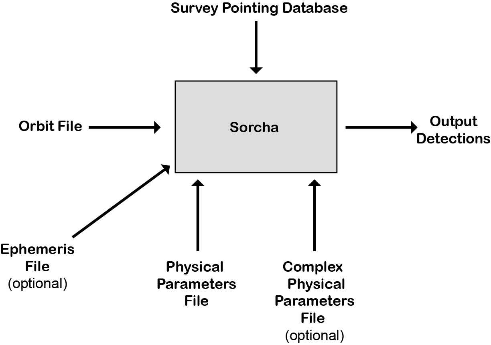

.. _output:

Outputs
==================

``Sorcha`` outputs:
  * :ref:`Detections File <detections>` (list of all the detections of the input popuation made by the simulated survey
  * (Optioaal) :ref:`Statistics (Tally) File <statsf>`  that provides a summary overview for the objects from the input population that were ''found'' in the simulated survey
  * (Optional) :ref:`Ephemeris Output <ephem_output>` that provides the output from the :ref:`Ephemeris Generation<ephemeris_gen>`  

.. attention::
   Use the **-o (--outfile)** flag with the **sorcha run** command to specify where ``Sorcha`` should be  saving any output and log files (the file path).

.. tip::
   By default ``Sorcha`` will complain if a user attempts to overwrite existing files in the output directory. Users can apply the **-f (--force)** flag to force deletion/overwrite of existing the output file(s).

Output File Formats
----------------------------
The :ref:`configuration file<configs>` keyword output_format in the OUTPUT section allows ``Sorcha`` to output files in CSV, SQLite3 or HDF5 formats.  For example::

   [OUTPUT]
   # The options: csv, sqlite3, hdf5
    output_format = csv
 
.. note::
   If you are outputting to a SQLite3 database, the data will be saved in a table named 'sorcha_results'.

.. warning::
   If you are writing to a HDF5 file that you plan to access using the PyTables library, note that your object IDs cannot begin
   with a number (due to a limitation in PyTables).

.. attention::
   Use the **-t (--stem)** flag on the command line to specify the filename stem for all the ``Sorcha`` output files and logs.

.. _detections:

Detections File
----------------------

``Sorcha`` produces a detections file describing each predicted survey detection of the input small body populations, 
with a row for each predicted detection and a column for each parameter  calculated.

Additionally, the output columns of the detections file  can be set to either "basic" or "all" settings (described below) using the output_columns :ref:`configuration file<configs>` keyword. 

.. _basic:

Basic Output
~~~~~~~~~~~~~~~~~~~~~~~~~~~~~~~~~~~~~~~
The "basic" output includes the columns most relevant to general photometry and detection purposes. This is declared
in the :ref:`configuration file<configs>` like so::

    [OUTPUT]
    output_columns = basic

Detections File: Basic Output Column Names, Formats, and Descriptions
^^^^^^^^^^^^^^^^^^^^^^^^^^^^^^^^^^^^^^^^^^^^^^^^^^^^^^^^^^^^^^^^^^^^^^^^^
   
+------------------------------------+--------------+----------------------------------------------------------------------------------+
| Keyword                            | Format       | Description                                                                      |
+====================================+==============+==================================================================================+
| ObjID                              | String       | Unique string identifier                                                         |
+------------------------------------+--------------+----------------------------------------------------------------------------------+
| fieldMJD_TAI                       | Float        | MJD (International Atomic Time Modified Julian Date) of the observation          |
+------------------------------------+--------------+----------------------------------------------------------------------------------+
| fieldRA_deg                        | Float        | Right ascension (RA) of the center of the observation pointing (degrees)         | 
+------------------------------------+--------------+----------------------------------------------------------------------------------+
| fieldDec_deg                       | Float        | Declination (Dec) of the center of the observation pointing (degrees)            |
+------------------------------------+--------------+----------------------------------------------------------------------------------+
| RA_deg                             | Float        | Object Right Ascension (RA) (degrees)                                            |
+------------------------------------+--------------+----------------------------------------------------------------------------------+
| Dec_deg                            | Float        | Object Declination (Dec) (degrees)                                               |
+------------------------------------+--------------+----------------------------------------------------------------------------------+
| astrometricSigma_deg               | Float        | Astrometric uncertainty in object (ra, dec) position (degrees)                   |
+------------------------------------+--------------+----------------------------------------------------------------------------------+
| optFilter                          | String       | Filter (band) for this observation (ugrizy)                                      |
+------------------------------------+--------------+----------------------------------------------------------------------------------+
| trailedSourceMag                   | Float        | Observed apparent magnitude, fit as a trailed source                             |
+------------------------------------+--------------+----------------------------------------------------------------------------------+
| trailedSourceMagSigma              | Float        | 1-:math:`{\sigma}` uncertainty on trailed source magnitude                       |
+------------------------------------+--------------+----------------------------------------------------------------------------------+
| fiveSigmaDepth_mag                 | Float        | Depth required for a 5-:math:`{\sigma}` detection at this source's location      |
+------------------------------------+--------------+----------------------------------------------------------------------------------+
| phase_deg                          | Float        | The sun-object-observer angle (degrees)                                          |
+------------------------------------+--------------+----------------------------------------------------------------------------------+
| Range_LTC_km                       | Float        | Light-time-corrected object-observer distance (km)                               |
+------------------------------------+--------------+----------------------------------------------------------------------------------+
| RangeRate_LTC_km_s                 | Float        | Light-time-corrected rate of change of the object-observer distance (km/s)       |
+------------------------------------+--------------+----------------------------------------------------------------------------------+
| Obj_Sun_LTC_km                     | Float        | Object-sun light-time-corrected distance (km)                                    |
+------------------------------------+--------------+----------------------------------------------------------------------------------+
| object_linked                      | Boolean      | True/False whether the object passed the linking filter. See note below          |
+------------------------------------+--------------+----------------------------------------------------------------------------------+
| date_linked_MJD                    | Boolean      | MJD (TAI) Date the object was linked (if it was linked) See note below           |
+------------------------------------+--------------+----------------------------------------------------------------------------------+

.. note::
   All positions and velocities are in respect to J2000.
   
.. note::
   The **date_linked_MJD** only appears if :ref:`linking filter<linking>` is turned on. The **object_linked** column only appears if the :ref:`linking filter<linking>` is on and **drop_unlinked = False** in the :ref:`configuration file<configs> (the user has requested that detections of unlinked objects not be dropped in the output).

.. warning::
   If you are writing to a HDF5 file that you plan to access using the PyTables library, note that your object IDs cannot begin
   with a number (due to a limitation in PyTables).

Example Detections File in Basic Format
^^^^^^^^^^^^^^^^^^^^^^^^^^^^^^^^^^^^^^^^^^

.. code-block::

   ObjID,fieldMJD_TAI,fieldRA_deg,fieldDec_deg,RA_deg,Dec_deg,astrometricSigma_deg,optFilter,PSFMag,trailedSourceMag,PSFMagSigma,trailedSourceMagSigma,fiveSigmaDepth_mag,fiveSigmaDepthAtSource
   S1000000a,61769.320619,163.87542090842982,-18.84327137012991,164.03771300000017,-17.58257500000004,2.9880927198448093e-06,r,19.667095021023798,19.655534004675797,0.006775654132479691,0.006755926588113991,23.86356436464961,23.839403736057715
   S1000000a,61769.332335,163.87542090842982,-18.84327137012991,164.03840499999956,-17.583782000000177,3.0580983448792015e-06,i,19.654439857054346,19.651499866857677,0.008648382870172588,0.00861644095296432,23.50948086026021,23.485408367730255
   S1000000a,61773.283672,163.33185289781585,-17.478349047859123,164.25272700000096,-17.970833000000166,2.8628267283501646e-06,g,19.605094385361397,19.59913996244041,0.004573058990569846,0.004562676340629368,24.412081324532746,24.40274105573913
   S1000000a,61773.304607,163.33185289781585,-17.478349047859123,164.2535509999998,-17.972800999999485,2.8619239276501636e-06,r,19.60417845127433,19.610463241887746,0.005414938113316873,0.005396964439230442,24.142184414583568,24.132798535794453
   S1000000a,61780.286672,163.70205228035468,-18.10471138055092,164.4364500000006,-18.561287999999216,3.106487369364405e-06,i,19.50224387218658,19.49961057650898,0.00996299590797273,0.009945212307287087,23.1343489868631,23.13059981155987
   S1000000a,61780.310927,163.70205228035468,-18.10471138055092,164.4365160000002,-18.56311500000129,3.0899264531165437e-06,z,19.506070321795203,19.506622970072044,0.01126449135209172,0.011237007559280756,22.968207967454678,22.964441345175853
   S1000000a,61781.239134,163.95033588103914,-18.031113105727716,164.44201499999986,-18.63119400000105,3.2223774034283947e-06,i,19.50028114807821,19.494448387335947,0.01214406799779637,0.01212132996202541,22.85013563621249,22.84858482288965
   S1000000a,61781.263141,163.95033588103914,-18.031113105727716,164.4419770000004,-18.63294700000159,3.042088583360277e-06,z,19.486562767073988,19.47832341807803,0.011723502868190884,0.011688663662533069,22.899894717824814,22.898283896399494
   S1000000a,61789.27659,164.99043640246796,-19.09523631317997,164.29665099999988,-19.110176000000447,2.8895553381860802e-06,z,19.376978135088684,19.359651855968583,0.008079363622311368,0.00805998568672928,23.293210067462763,23.293123719813384

.. _full:

Full Output
~~~~~~~~~~~~~~~~~~~~~~~~~~~~~~~~~~~~~~~
The 'all' output option includes all columns from the basic output, as well as those relevant to ephemeris generation for each 
predicted detection, and some of the input orbital and physical parameters of each simulated object. All columns within the pandas databframe at the end of the ``Sorcha`` run are written out.  This is declared in the :ref:`configuration file<configs>` like so::

    [OUTPUT]
    output_columns = all

Detections File: Full Output Column Names, Formats, and Descriptions 
^^^^^^^^^^^^^^^^^^^^^^^^^^^^^^^^^^^^^^^^^^^^^^^^^^^^^^^^^^^^^^^^^^^^^^^^

+------------------------------------+--------------+----------------------------------------------------------------------------------------------------------+
| Keyword                            | Format       | Description                                                                                              |
+====================================+==============+==========================================================================================================+
| ObjID                              | String       | Unique string identifier                                                                                 |
+------------------------------------+--------------+----------------------------------------------------------------------------------------------------------+
| fieldMJD_TAI                       | Float        | MJD (International Atomic Time Modified Julian Date) of the observation                                  |
+------------------------------------+--------------+----------------------------------------------------------------------------------------------------------+
| fieldJD_TDB                        | Float        | JD (Barycentric Julian Date) of the observation                                                          |
+------------------------------------+--------------+----------------------------------------------------------------------------------------------------------+
| Range_LTC_km                       | Float        | Light-time-corrected object-observer distance (km)                                                       |
+------------------------------------+--------------+----------------------------------------------------------------------------------------------------------+
| RangeRate_LTC_km_s                 | Float        | Light-time-corrected rate of change of the object-observer distance (km/s)                               |
+------------------------------------+--------------+----------------------------------------------------------------------------------------------------------+
| RA_true_deg                        | Float        | Calculated value of object right ascension unadjusted for astrometric uncertainty (degrees)              |
+------------------------------------+--------------+----------------------------------------------------------------------------------------------------------+
| RARateCosDec_deg_day               | Float        | Object right ascension rate of motion (deg/day)                                                          |
+------------------------------------+--------------+----------------------------------------------------------------------------------------------------------+
| Dec_true_deg                       | Float        | Calculated value of object declination unadjusted for astrometric uncertainty  (degrees)                 |
+------------------------------------+--------------+----------------------------------------------------------------------------------------------------------+
| DecRate_deg_day                    | Float        | Object declination rate of motion (deg/day)                                                              |
+------------------------------------+--------------+----------------------------------------------------------------------------------------------------------+
| Obj_Sun_x_LTC_km                   | Float        | Heliocentric object-sun light-time-corrected Cartesian x distance (km)                                   |
+------------------------------------+--------------+----------------------------------------------------------------------------------------------------------+
| Obj_Sun_y_LTC_km                   | Float        | Heliocentric object-sun light-time-corrected Cartesian y distance (km)                                   |
+------------------------------------+--------------+----------------------------------------------------------------------------------------------------------+
| Obj_Sun_x_LTC_km                   | Float        | Heliocentric object-sun light-time-corrected Cartesian z distance (km)                                   |
+------------------------------------+--------------+----------------------------------------------------------------------------------------------------------+
| Obj_Sun_vx_LTC_km_s                | Float        | Heliocentric object-sun light-time-corrected Cartesian x velocity (km/s)                                 |
+------------------------------------+--------------+----------------------------------------------------------------------------------------------------------+
| Obj_Sun_vy_LTC_km_s                | Float        | Heliocentric object-sun light-time-corrected Cartesian y velocity (km/s)                                 |
+------------------------------------+--------------+----------------------------------------------------------------------------------------------------------+
| Obj_Sun_vz_LTC_km_s                | Float        | Heliocentric object-sun light-time-corrected Cartesian z velocity (km/s)                                 |
+------------------------------------+--------------+----------------------------------------------------------------------------------------------------------+
| Obj_Sun_x_km                       | Float        | Heliocentric object-sun Cartesian x distance (km)                                                        |
+------------------------------------+--------------+----------------------------------------------------------------------------------------------------------+
| Obj_Sun_y_km                       | Float        | Heliocentric object-sun Cartesian y distance (km)                                                        |
+------------------------------------+--------------+----------------------------------------------------------------------------------------------------------+
| Obj_Sun_x_km                       | Float        | Heliocentric object-sun Cartesian z distance (km)                                                        |
+------------------------------------+--------------+----------------------------------------------------------------------------------------------------------+
| Obj_Sun_vx_km_s                    | Float        | Heliocentric object-sun Cartesian x velocity (km/s)                                                      |
+------------------------------------+--------------+----------------------------------------------------------------------------------------------------------+
| Obj_Sun_vy_km_s                    | Float        | Heliocentric object-sun Cartesian y velocity (km/s)                                                      |
+------------------------------------+--------------+----------------------------------------------------------------------------------------------------------+
| Obj_Sun_vz_km_s                    | Float        | Heliocentric object-sun Cartesian z velocity (km/s)                                                      |
+------------------------------------+--------------+----------------------------------------------------------------------------------------------------------+
| phase_deg                          | Float        | The sun-object-observer angle (degrees)                                                                  |
+------------------------------------+--------------+----------------------------------------------------------------------------------------------------------+
| epochMJD_TDB                       | Float        | Epoch of orbit (MJD) in Barycentric Dynamical Time                                                       |
+------------------------------------+--------------+----------------------------------------------------------------------------------------------------------+
| t_p_MJD_TDB                        | Float        | Time of periapsis (MJD)  in Barycentric Dynamical Time                                                   |
+------------------------------------+--------------+----------------------------------------------------------------------------------------------------------+
| argPeri                            | Float        | Argument of periaspsis of the object (degrees)                                                           |
+------------------------------------+--------------+----------------------------------------------------------------------------------------------------------+
| node                               | Float        | Longitude of the ascending node of the object (degrees)                                                  |
+------------------------------------+--------------+----------------------------------------------------------------------------------------------------------+
| inc                                | Float        | Orbital inclination (degrees)                                                                            |
+------------------------------------+--------------+----------------------------------------------------------------------------------------------------------+
| e                                  | Float        | Orbital eccentricity                                                                                     |
+------------------------------------+--------------+----------------------------------------------------------------------------------------------------------+
| q                                  | Float        | Object perihelion (au)                                                                                   |
+------------------------------------+--------------+----------------------------------------------------------------------------------------------------------+
| FORMAT                             | Float        | Orbit format string (COM for heliocentric, BCOM for barycentric, KEP for Keplerian, CART for Cartesian)  |
+------------------------------------+--------------+----------------------------------------------------------------------------------------------------------+
| H_filter                           | Float        | Predicted measurement of absolute magnitude in the corresponding filter                                  |
+------------------------------------+--------------+----------------------------------------------------------------------------------------------------------+
| *Phase parameters*                 | Float        | (If specified) Phase curve parameter(s) for all filters (G12, G1 & G2, or :math:`{\beta}`)               |
+------------------------------------+--------------+----------------------------------------------------------------------------------------------------------+
| visitTime                          | Float        | Total length of time for a visit (seconds)                                                               |
+------------------------------------+--------------+----------------------------------------------------------------------------------------------------------+
| visitExposureTime                  | Float        | Total exposure time for a visit (seconds)                                                                |
+------------------------------------+--------------+----------------------------------------------------------------------------------------------------------+
| optFilter                          | String       | Filter (band) for this observation (ugrizy)                                                              |
+------------------------------------+--------------+----------------------------------------------------------------------------------------------------------+
| seeingFwhmGeom_arcsec              | Float        | Geometric full-width half-maximum for the field (arcsec)                                                 |
+------------------------------------+--------------+----------------------------------------------------------------------------------------------------------+
| seeingFwhmEff_arcsec               | Float        | Effective full-width half-maximum for the field (arcsec)                                                 |
+------------------------------------+--------------+----------------------------------------------------------------------------------------------------------+
| fieldFiveSigmaDepth_mag            | Float        | 5-:math:`{\sigma}` limiting magnitude at the centre of the field of view                                 |
+------------------------------------+--------------+----------------------------------------------------------------------------------------------------------+
| fieldRA_deg                        | Float        | Right ascension (RA) of the center of the observation pointing (degrees)                                 | 
+------------------------------------+--------------+----------------------------------------------------------------------------------------------------------+
| fieldDec_deg                       | Float        | Declination (Dec) of the center of the observation pointing (degrees)                                    |
+------------------------------------+--------------+----------------------------------------------------------------------------------------------------------+
| fieldRotSkyPos_deg                 | Float        | Angle of the field y-axis and celestial north, oriented towards increasing right ascension               |
+------------------------------------+--------------+----------------------------------------------------------------------------------------------------------+
| H_{main filter}                    | Float        | Absolute magnitude in the specified main filter                                                          |
+------------------------------------+--------------+----------------------------------------------------------------------------------------------------------+
| trailedSourceMagTrue               | Float        | Observed apparent magnitude, fit as a trailed source, not adjusted for photometric uncertainty           |
+------------------------------------+--------------+----------------------------------------------------------------------------------------------------------+
| PSFMagTrue                         | Float        | Observed PSF magnitude, fit as a trailed source, not adjusted for photometric uncertainty                |
+------------------------------------+--------------+----------------------------------------------------------------------------------------------------------+
| fiveSigmaDepth_mag                 | Float        | 5-:math:`{\sigma}` limting magnitude at the location of the object on the focal plane                    |
+------------------------------------+--------------+----------------------------------------------------------------------------------------------------------+
| astrometricSigma_deg               | Float        | Astrometric uncertainty in object (ra, dec) position (degrees)                                           |
+------------------------------------+--------------+----------------------------------------------------------------------------------------------------------+
| trailedSourceMagSigma              | Float        | 1-:math:`{\sigma}` uncertainty on trailed source magnitude                                               |
+------------------------------------+--------------+----------------------------------------------------------------------------------------------------------+
| SNR                                | Float        | Predicted signal-to-noise ratio of detection                                                             |
+------------------------------------+--------------+----------------------------------------------------------------------------------------------------------+
| PSFMagSigma                        | Float        | 1-:math:`{\sigma}` uncertainty on PSF magnitude                                                          |
+------------------------------------+--------------+----------------------------------------------------------------------------------------------------------+
| trailedSourceMag                   | Float        | Observed apparent magnitude, fit as a trailed source                                                     |
+------------------------------------+--------------+----------------------------------------------------------------------------------------------------------+
| PSFMag                             | Float        | Observed apparent magnitude, fit with a point spread function                                            |
+------------------------------------+--------------+----------------------------------------------------------------------------------------------------------+
| RA_deg                             | Float        | Measured object Right Ascension (RA) (degrees)                                                           |
+------------------------------------+--------------+----------------------------------------------------------------------------------------------------------+
| Dec_deg                            | Float        | Measured object Declination (Dec) (degrees)                                                              |
+------------------------------------+--------------+----------------------------------------------------------------------------------------------------------+
| detectorID                         | Float        | Identifier of the detector covering the observation                                                      |
+------------------------------------+--------------+----------------------------------------------------------------------------------------------------------+
| Obj_Sun_LTC_km                     | Float        | Object-sun light-time-corrected distance (km)                                                            |
+------------------------------------+--------------+----------------------------------------------------------------------------------------------------------+

.. note::
   All positions, positions, and velocities are in respect to J2000.

.. note::
   All columns in the comple physicalx parameters file will also be included in the full output. 

.. warning::
   If you are writing to a HDF5 file that you plan to access using the PyTables library, note that your object IDs cannot begin
   with a number (due to a limitation in PyTables).

Optional  Outputs
----------------------

.. _statsf:
   
Statistics (Tally) File
~~~~~~~~~~~~~~~~~~~~~~~~~~~~~~~~~~~~~~~
``Sorcha`` can also output a statistics or "tally" file (if specified uisng the **--st flag)  which contains an overview of the ``Sorcha`` output for each object and filter. Minimally, this
file lists the number of observations for each object in each filter, along with the minimum, maximum and median apparent magnitude and the minimum and maximum
phase angle. If the :ref:`linking filter<linking>` is on, this file also contains information on whether and when the object was linked by SSP.

.. attention::
   Use the **-st** flag on the command line to initialize ``Sorcha`` to generate the statistics file and specify the file stem for the resulting file.

Statistics (Tally) File Column Names, Formats, and Descriptions
^^^^^^^^^^^^^^^^^^^^^^^^^^^^^^^^^^^^^^^^^^^^^^^^^^^^^^^^^^^^^^^^^^^^

+------------------------------------+--------------+----------------------------------------------------------------------------------------------------------+
| Keyword                            | Format       | Description                                                                                              |
+====================================+==============+==========================================================================================================+
| ObjID                              | String       | Unique string identifier                                                                                 |
+------------------------------------+--------------+----------------------------------------------------------------------------------------------------------+
| optFilter                          | String       | Filter (band) (ugrizy)                                                                                   |
+------------------------------------+--------------+----------------------------------------------------------------------------------------------------------+
| number_obs                         | Integer      | Number of observations for this object in this filter                                                    |
+------------------------------------+--------------+----------------------------------------------------------------------------------------------------------+
| min_apparent_mag                   | Float        | Minimum calculated apparent magnitude for this object in this filter                                     |
+------------------------------------+--------------+----------------------------------------------------------------------------------------------------------+
| max_apparent_mag                   | Float        | Maximum calculated apparent magnitude for this object in this filter                                     |
+------------------------------------+--------------+----------------------------------------------------------------------------------------------------------+
| median_apparent_mag                | Float        | Median calculated apparent magnitude for this object in this filter                                      |
+------------------------------------+--------------+----------------------------------------------------------------------------------------------------------+
| min_phase                          | Float        | Minimum calculated phase angle for this object in this filter (degrees)                                  |
+------------------------------------+--------------+----------------------------------------------------------------------------------------------------------+
| min_phase                          | Float        | Maximum calculated phase angle for this object in this filter (degrees)                                  |
+------------------------------------+--------------+----------------------------------------------------------------------------------------------------------+
| object_linked                      | Boolean      | True/False whether the object was linked by SSP (only included if linking is on)                         |
+------------------------------------+--------------+----------------------------------------------------------------------------------------------------------+
| date_linked_MJD                    | Float        | Date the object was linked (if it was linked) in MJD (only included if linking is on)                    |
+------------------------------------+--------------+----------------------------------------------------------------------------------------------------------+

.. note::
Unless the user has specified **drop_unlinked = False** in the :ref:`configuration file<configs>`, the object_linked column will read TRUE for all objects. To see which objects were not linked by ``Sorcha``, this variable must be set to False.

.. _ephem_output:
  
Ephemeris Output
~~~~~~~~~~~~~~~~~~~~~~~~~~~~~~~~~~~~~~~
Optionally (with the **--ew (--ephem-write)** flag set at the command line), an ephemeris file of all detections near the
field can be generated to a separate file, which can then be provided back to ``Sorcha`` as an optional external ephemeris file with the **--er (--ephem-read)** flag.
More information can be found on this functionality, including the output columns, in the :ref:`Ephemeris Generation<ephemeris_gen>` section of the documentation.

The format of the outputted ephemeris file is controlled by the **eph_format** configuration keyword in the Inputs section of the :ref:`configuration file<configs>` ::

   [INPUT]
   ephemerides_type = external
   eph_format = csv

.. attention::
   Users should note that output produced by reading in a previously generated ephemeris file will be in a different order than the output produced when running the ephemeris generator within ``Sorcha``. This is simply a side-effect of how  ``Sorcha`` reads in ephemeris files and does not affect the actual content of the output.

.. tip::
   If instead you want to know which of the input small body population lands in the survey observations with an estimate of their apparent magnitude wihtout applying any other cuts or filters on the detections (not including discovery efficiency and linking effects), you can use/adapt the :ref:`known_config` example :ref:`configs`.

