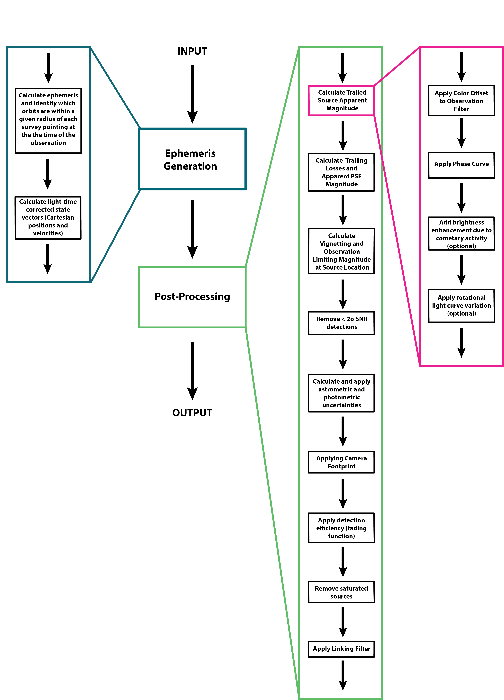

Overview
=================

.. seealso::
   For a more detailed description of ``Sorcha`` and how it works, please see  `Merritt et al. (submitted) <https://www.dropbox.com/scl/fi/secetw7n0a936iynzxmau/sorcha_paper_2025_Jan_submission_version.pdf?rlkey=pbhchiattrw5bna8sfo6ljvto&dl=0>`_  and `Holman et al. (submitted) <https://www.dropbox.com/scl/fi/lz1lmua2s0yf9t9a2gpmm/sorcha_ephemeris_generation_paper.pdf?rlkey=blm9u4zbk0ci1i4lc5yqz8dbs&dl=0>`_.

How Sorcha Works
-------------------------------

In order to conduct detailed population studies on the orbital properties and physical characteristics of the various Solar System small body reservoirs, one must account for all the survey biases (the complex and often intertwined detection biases – brightness limits,
pointing, cadence, on-sky motion limits, software detection efficiencies) in one’s discovery survey (`see Lawler et al. 2018 <https://ui.adsabs.harvard.edu/abs/2018FrASS...5...14L/abstract>`_ for a more detailed discussion). ``Sorcha`` is an open-source Python Solar System survey simulator designed for the `Vera C. Rubin Observatory Legacy Survey of Space and Time (LSST) <https://rubinobservatory.org>`_. ``Sorcha`` works by the user inputting a synthetic Solar System small body population. The software forward models the input population to simulate what the survey should have detected using a series of calculations and filters. These can be switched on or off and customized as needed via a :ref:`configuration file<configs>`. In this way, a synthetic population can be compared to the real survey's discoveries. 

The :ref:`inputs<Inputs>` that ``Sorcha`` requires are shown in the figure below. The software requires input files that describe the small bodies to simulate and the details of the survey such as the observation history and optionally the layout of the survey's camera. ``Sorcha`` :ref:`outputs<output>` simulated detection data, including each time, position, and apparent magnitude at which a synthetic small body was detected based on various options set up in a :ref:`configuration file<configs>`.  ``Sorcha`` can account for :ref:`rotational light curve and cometary activity effects<addons>`; we have set up  ``Sorcha`` such that the user can provide their own custom formulations and import them into ``Sorcha`` to use.

.. image:: images/survey_simulator_flow_chart.png
  :width: 800
  :alt: An overview of the inputs and outputs for Sorcha

``Sorcha`` is split into two stages :ref:`ephemeris generation<ephemeris_gen>` and :ref:`post-processing<post_processing>`. **Ephemeris generation** calculates the on-sky position of the simulated objects and matches them to the survey observations in which they appear. **Post-Processing** performs the apparent magnitude calculations and apply the rest of the survey's observational biases (such as detection effiency) in order to identify which objects in the input small body population would have been discovered by the discovery and the observations the objects would have been detected in.  

``Sorcha`` by default uses its own :ref:`ephemeris generator<ephemeris_gen>` to propagate the orbits and translate them to on-sky locations and rates. ``Sorcha``'s ephemeris generator is powered by `ASSIST  <https://github.com/matthewholman/assist>`_, a software package for ephemeris-quality integrations of test particles, and the `REBOUND <https://rebound.readthedocs.io/en/latest/>`_ N-body integrator.  If the user prefers to use a different generator, ``Sorcha`` can  be initialized with an external ephemeris file with pre-calculated ephemerides of the input synthetic orbital population.  

The default main steps, calculations, and filters within ``Sorcha`` that are used to estimate what the LSST would discover are shown below. 

Design Philosophy 
----------------------
``Sorcha``  has been designed in a modular way such that each calculation and filtering step is written as its own function. This makes it easy for modifications in the future if required by users. How ``Sorcha`` runs can be customized via its  :ref:`configuration file<configs>`. ``Sorcha`` has been designed with LSST in mind, but many of the filters already developed will be applicable to other Solar System surveys.  

.. note::
   Contributions are very welcome. If there is a feature or functionality not yet available in ``Sorcha``, we encourage you to propose the feature as an issue in the `main github repository <https://github.com/dirac-institute/sorcha/issues>`_ or share your code with the new enhancements. If you are interested in incorporating your survey into ``Sorcha`` do reach out. Further details can be found on our :ref:`reporting` page.
      
Using Sorcha in Your Science
--------------------------------
We made ``Sorcha`` to be a tool for the small body planetary astronomer community. For a wide variety of use cases, the user should be able to use ``Sorcha`` straight out of the box.

.. note::
    If  ``Sorcha``  enabled your science, please make sure to give the proper credit in your talks and papers by citing the relevant ``Sorcha`` papers and the python packages that the software is built upon. Further details can be found :ref:`here<citethecode>`.

.. warning::
  We have designed ``Sorcha`` such that it should be straightforward to add in additional filters or rotational light curve/activity classes. As with any open-source package, **once the user has made modifications to the code, it is the responsibility of the user to confirm these changes provide an accurate result**.

