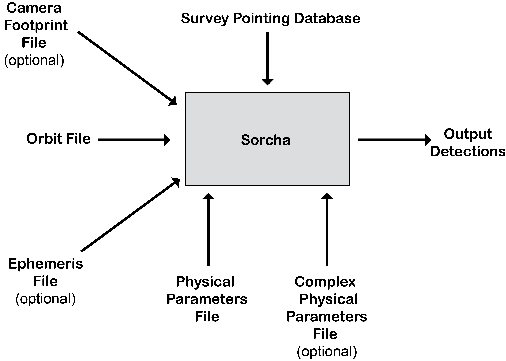

How Sorcha Works
=================

Overview
-------------------------------

To do detailed population studies on the orbital properties and physical characteristics of the various Solar System small body reservoirs, one must account for all the survey biases (the complex and often intertwined detection biases – brightness limits,
pointing, cadence, on-sky motion limits, software detection efficiencies) in one’s discovery survey (`see Lawler et al. 2018 <https://ui.adsabs.harvard.edu/abs/2018FrASS...5...14L/abstract>`_ for a more detailed discussion). Sorcha is an open source python Solar System survey simulator designed for the `Vera C. Rubin Observatory Legacy Survey of Space and Time (LSST) <https://www.lsst.org/>`_. Sorcha takes an input model small body population and outputs (biases the population to) what Rubin Observatory should have detected by utilizing the LSST pointing history, observation metadata, and the Rubin Solar System Processing (SSP) pipeline’s detection efficiency. 

How Sorcha Works
-------------------------------

Sorcha works by the user inputting a synthetic Solar System small body population. The inputs Sorcha requires is shown in the figure below. Each of these files are described in greater detail in the :ref:`inputs` Section. Sorcha applies the specific observational biases relevant for the specified survey. In this way, a synthetic population can be compared to the real survey's discoveries. Sorcha identifies which of the synthetic small bodies land within in a given pointing of the specified survey. Then the various observational biases are applied to these potential detections using what we have called :ref:`filters<Filters>`.  The filters can be switched
on or off as needed  via a  configuration file.

Sorcha by default uses its own ephemeris generator to propagate the orbits and translate them to on-sky locations and rates. Sorcha's ephemeris generator is powered by `ASSIST  <https://github.com/matthewholman/assist>`_, a software package for ephemeris-quality integrations of test particles, and the `REBOUND <https://rebound.readthedocs.io/en/latest/>`_ N-body integrator. If the user prefers to use a different generator, they have the ability to give Sorcha an ephemeris file to ingest instead. 

.. warning::
   We have validated Sorcha with its internal ephemeris generator. If the user chooses to use a different ephemeris engine's calculations as input for Sorcha, the user has the responsibility to check the accuracy of this input.
   

Design Philosophy 
----------------------
Sorcha  has been designed in a modular way. Each filter is written as its own function, This makes it easy to add new filters in the future if required by users. We note for dealing with rotational light curve and activity effects, we have setup Sorcha such that the user can provide their own custom classes/functions and import them into Sorcha to use. Sorcha has been designed with LSST in mind, but many of the filters already developed will be applicable to other Solar System surveys. If you are interested in incorporating your survey into Sorcha do reach out.  

.. warning::
  For a wide variety of use cases, the user should be able to use Sorcha straight out of the box. We have designed the software such that it should be straightforward to add in additional filters or rotational light curve/activity classes. As with any open source package, **once the user has made modifications to the code, it is the responsibility of the user to confirm these changes provide an accurate result**. 
   
   
.. note::
   Contributions are very welcome. If there is a feature or functionality not yet available in Sorcha, we encourage you to propose the feature as an issue in the `main Sorcha repository <https://github.com/dirac-institute/survey_simulator_post_processing/issues>`_ or share your code with the new enhancements. Further details can be found on our :ref:`reporting` page.
      

