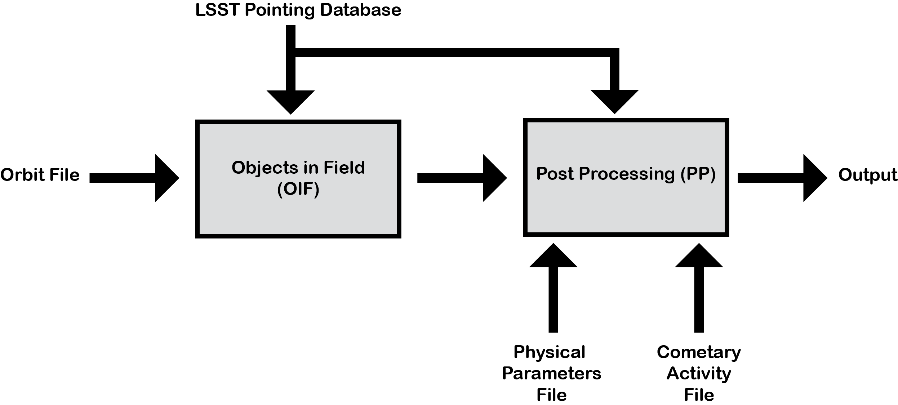

Overview
========
The `Vera C. Rubin Observatory Legacy Survey of Space and Time (LSST) <https://www.lsst.org/>`_ Solar System Science Collaboration (SSSC) Science Roadmap `(Schwamb et al. 2018) <https://ui.adsabs.harvard.edu/abs/2018arXiv180201783S/abstract>`_ highlights 
probing the orbital distributions, size/brightness distributions, and surface colours
as the top LSST science priorities in each of the Solar System small body populations. In order to do detailed 
population studies on the orbital properties and physical characteristics of the various Solar System small body reservoirs, one
requires being able to account for all the survey biases (the complex and often intertwined detection biases – brightness limits,
pointing, cadence, on-sky motion limits, software detection efficiencies) in one’s discovery survey (`see Lawler et al. 2018 <https://ui.adsabs.harvard.edu/abs/2018FrASS...5...14L/abstract>`_ for 
a more detailed discussion). A survey simulator takes an input model small body population and outputs (biases the population to)
what Rubin Observatory should have detected by utilizing the LSST pointing history, observation metadata, and Rubin Observatory 
Solar System Processing pipeline’s detection efficiency.

Overview of Use
------------------
The Survey Simulator is formed out of two python packages working in tandem. The first part is an ephemerides generator. While the user can use any relevant ephemerides generator, we reccomend using `Objects in Field (OIF) <https://github.com/eggls6/objectsInField>`_ package for this. 

.. note::
   `Objects in Field (OIF) <https://github.com/eggls6/objectsInField>`_ is powered by the python version of `(openorb) <https://github.com/oorb/oorb>`_, an open-source orbit-computation package, using SPICE kenrnels to calculate the positions of the planets and a set of input planetesimal orbits hosted by the `Navigation and Ancillary Information Facility (NAIF) <https://naif.jpl.nasa.gov/naif/>`_ team of the Jet Propulsion Laboratory (JPL). 
   
   
The second piece of software is `Post Processing (surveySimPP) <https://github.com/dirac-institute/survey_simulator_post_processing>`_,
which applies the relevant biases to the simulated data, though a set of :ref:`filters<Filters>`.

Both OIF and surveySimPP take a series of inputs. The basic pipeline overview can be seen below. The user generates a population with a set of orbits. This
orbital parameter file is processed by Objects in Field (or any other orbital code) with respect to the LSST 
pointing database, before being passed into the survey simulator. Here the user can alter the configuration
file to apply relevant :ref:`filters<Filters>`, which account for the observational biases in LSST. An optional cometary 
parameter file can also be added here.

.. warning::
   We have validated surveySimPP with Objects In Field. If the user chooses to use a different emphemeris engine's calculations as input for surveySimPP, the user has the responsibiilty to check the accuracy of this input.
   
 

Design Philosophy 
----------------------
The surveySimPP package is designed to compliment LSST observations, as a way to study
Solar System object population statistics. The user is able to create synthetic population statistics and 
run them through the survey simulator, which applies the specific observational biases from the LSST. In 
this way, a synthetic population can be compared to real LSST observations. The survey simulator code 
takes a series of simulated object orbits and parameters as an input and applies a range of biases that are 
associated with the LSST, using what we have called :ref:`Filters<Filters>`.

While this survey simulator has been built with LSST in mind, it has been written in a way which allows
for customisation and can be applied in a general manner. The filters which can be applied can be switched
on or off depending on the population in question and users can easily write and insert their own filters 
for their specific needs.
 
The software is open source and written in a modular way, where each filter has been written as its
own function. We have developed a suite of filters which should cover the majority
of use cases for the LSST, but there is a possibility to adapt the code for the users own goals. This
may come in the form of adding additional filters or by adapting the software for use with another wide-field survey.
The set of filters that can be applied to the synthetic input population can also be varies based on the population and science case of the user.

We have provided a rigorous validation to the current version of the code. The filters provided can be switched on and off via 
a configuration file and command line arguments, depending on the users needs. While the software is versatile, we understand that
users may wish to adapt the python code to suit their specific needs. **In this case, it is up to the user themselves to validate the 
changes that they have made.**
   
   
.. warning::
   We have designed the software in a modular way to make it easier to adapt and modify surveySimPP as needed. As with any open source package, once the user has made modifications to the codebase published in the  `online repository <https://github.com/dirac-institute/survey_simulator_post_processing>`_, **it is the responsibility of the user to confirm these changes provide an accurate result**. 
   
   
.. note::
   Contributions are very welcome. If there is a feature or functionality not yet available in surveySimPP, we encourage you to propose the feature as an issue in the `repository <https://github.com/dirac-institute/survey_simulator_post_processing/issues>`_ or share your code with the new enhacenements. Further details can be found on our :ref:`support page<Support>` page.
      

