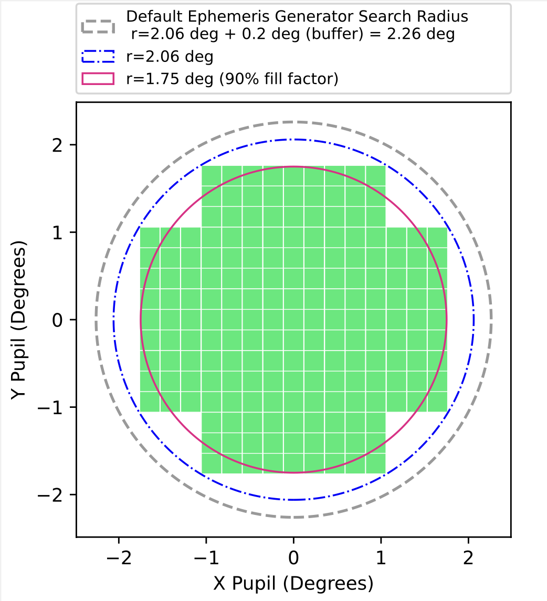

.. _post_processing:

Post-Processing (Applying Survey Biases)
==========================================================

.. seealso::
   For a more detailed description of ``Sorcha``'s post-processing stage please see Merritt et al. (submitted).

How it Works
------------------------

Once the ephemerides have been generated or read in from an external file, Sorcha moves on to
the second phase, which we call post-processing. For each of the input objects, Sorcha goes through
the potential observations identified in the ephemeris generation step and performs a series of
calculations and assessments in the post-processing stage to determine whether the objects would have
been detectable as a source in the survey images and would have later been identified as a moving
solar system object. All aspects of post-processing can be adjusted or turned on/off via ``Sorcha``'s :ref:`configs`.  

.. _mags::

Calculating the Trailed Source Magnitude and PSF (Point Spread Function) Magnitude
-------------------------------------------------------------------------------------

``Sorcha`` calculates two apparent magnitudes that we will refer to as the **trailed source magnitude** and the **PSF magnitude**. 

Below is a cartoon schematic depicting the difference between how the trailed source magnitude and the
PSF magnitude for a moving solar system object observed on an LSST image are estimated by the Rubin
data management pipelines (including Solar System Processing [SSP]). 

.. image:: images/trailed_source.png
  :width: 500
  :alt: A cartoon explanation of trailed source mag and PSF mag
  :align: center

.. seealso::
    See our `Jupyter notebook <notebooks/demo_ApparentMagnitudeValidation.ipynb>`_  that validates the apparent magnitude calulcation.

Phase Curves
~~~~~~~~~~~~~~~~~~~~~

.. _addons:

Incorporating Rotational Light Curves and Activity
------------------------------------------------------------
``Sorcha`` has the ability user provided functions though python classes that augment/change the apparent brightness calculations for the synthetic Solar System objects. Any values required as input for these calculations, must be provided in the separate :ref:`CPP` file as input. Rather than forcing the user directly modify  the ``Sorcha`` codebase every time they want to apply a different model for representing the effects of rotational lightcurves or cometary activity, we provide the ability to develop separate activity and lightcurve/brightness enhancement functions as  plugins using our template classes  and add them to the `Sorcha addons <https://github.com/dirac-institute/sorcha-addons>`_ package. In both cases, any derived class must inherit from the corresponding base class and follow its API, to ensure that Sorcha knows how to find and use your class. Once the Sorcha addons is installed, Sorcha will automatically detect the available plugins and make them available during post-processing.  To use one of the plugins from the community utilities, simply add the unique name of the plugin to the :ref:`configs` provided to Sorcha, and provide the  :ref:`CPP` file on the command line. We currently have 2 pre-made classes  that can augment the calculated apparent magnitude of each synthetic object, One for handling cometary activity as a function of heliocentric distance and one that applies rotational light curves to the synthetic objects.

Cometary Activity or Simulating Other Active Objects
~~~~~~~~~~~~~~~~~~~~~~~~~~~~~~~~~~~~~~~~~~~~~~~~~~~~~~~~

You can user cometary activity class provided in also your own class to apply a different comentary activity and add it into a custom version of the``Sorcha addons`` package.  Once the Sorcha-addons is installed, Sorcha will automatically detect the available plugins and make them available during processing.

Cometary Activity Configuration Parameters
~~~~~~~~~~~~~~~~~~~~~~~~~~~~~~~~~~~~~~~~~~~~~~~~~~~~~~

Set the **cometary_activity** :ref:`configuration file<configs>` file varialble to **none** if you do you want to apply any cometary activity brightness enhancements to ``Sorcha``'s apparent magnitude calculations. 

.. code-block::

   [ACTIVITY]

   # The unique name of the actvity model to use. Defined in the ``name_id`` method
   #  of the subclasses of AbstractCometaryActivity.  If not none, a complex physical parameters 
   # file must be specified at the command line.

   comet_activity = none

Cometary Activity Template Class 
^^^^^^^^^^^^^^^^^^^^^^^^^^^^^^^^^^^^^^^^
.. literalinclude:: ../src/sorcha/activity/base_activity.py
   :language: python

LSSTCometActivity Class
^^^^^^^^^^^^^^^^^^^^^^^^^^^^^^^^^^^^^^
.. seealso::
  We have an `example Jupyter notebook <notebooks/demo_Cometary_Activity.ipynb>`_  demonstrating the LSSTCometActivity class built into `Sorcha addons package  <https://github.com/dirac-institute/sorcha-addons>`_.

lsst_comet

Rotational Lightcurve Effects
~~~~~~~~~~~~~~~~~~~~~~~~~~~~~~~~~~~~~
The base lightcurve class is `AbstractLightCurve <https://github.com/dirac-institute/sorcha/blob/04baa79a7d67e1647b839a2d3880d8bfd9ce4624/src/sorcha/lightcurves/base_lightcurve.py#L10>`_ (see below). Inside the `Sorcha addons  GitHub repository <https://github.com/dirac-institute/sorcha-addons>`_, we provide a simple example implementation where the apparent magnitude of the object (that is, the magnitude after all geometric effects have been taken into account), has a sinusoidal term added to it. To use this function, in the :ref:`CPP` file, the user must provide a light curve amplitude (`LCA`), corresponding to half the peak-to-peak amplitude for the magnitude changes, a period `Period`, and a reference time `Time0` where the light curve is at 0 - if these are not provided, the software will produce an error message. Despite being simple, that implementation shows all the class methods that need to be implemented for a custom light curve function.

.. seealso::
  We have an `example Jupyter notebook <notebooks/demo_Lightcurve.ipynb>`_  demonstrating the SinusoidalLightCurve class built into `Sorcha addons package <https://github.com/dirac-institute/sorcha-addons>`_,

Lightcurve Template Class
^^^^^^^^^^^^^^^^^^^^^^^^^^^^^

.. literalinclude:: ../src/sorcha/lightcurves/base_lightcurve.py
   :language: python

Applying Photometric and Astrometric Uncerainties 
------------------------------------------------------------

Trailing Losses
-----------------

If the observed object is fast-moving, the signal will form a trail, reducing the measured magnitude.
This filter will recalculate the PSF magnitude of the observations, adjusting for trailing losses.

.. image:: images/Trail.png
  :width: 400
  :alt: Sky image showing a short trailing source circled in red.
  :align: center

.. _vignettting:

Accounting for Saturation (Saturation/Bright Limit Filter)
------------------------------------------------------------

The saturation/bright limit filter removes all detections that are brighter than the saturation limit
of the survey. `Ivezić et al. (2019) <https://ui.adsabs.harvard.edu/abs/2019ApJ...873..111I/abstract>`_
estimate that the saturation limit for the LSST will be ~16 in the r filter.

``Sorcha`` includes functionality to specify either a single saturation limit, or a saturation limit in each filter.
For the latter, limits must be given in a comma-separated list in the same order as the :ref:`optical filters set in the configuration file <whatobs>`

To include this filter, the :ref:`configs` should contain::

    [SATURATION]
    bright_limit = 16.0

Or::

    [SATURATION]
    bright_limit = 16.0, 16.1, 16.2

.. tip::
  The saturation filter is only applied if the :ref:`configuration file<configs>` has a SATURATION section.

Calculating the 5σ Limiting Magnitude at the Source Location and Vignetting
----------------------------------------------------------------------------------------------------

Objects that are on the edges of the field of view are dimmer due to vignetting: the field-of-view is not
uniformly illuminated, and so the limiting magnitude for each detection will depend on its position within the FOV (field-of-view).
The effect of this is to decrease the 5σ limiting magnitude – the apparent magnitude where a detected point source has exactly a
50% probability of detection – at the edges of the LSSTCam FOV. Sorcha accommodates this by
calculating the effects of vignetting at the source’s location on the focal plane and adjusting the
5σ limiting magnitude accordingly for each potential detection. This modified limiting magnitude
will be used when applying the survey detection efficiency. We this value the **5σ Limiting Magnitude at the Source Location**

``Sorcha``  applies a vignetting model from a built-in function tailored specifically for the LSST (see
`Araujo-Hauck et al. 2016 <https://ui.adsabs.harvard.edu/abs/2016SPIE.9906E..0LA/abstract>`_). The image below shows the
effects of vignetting on the 5σ limiting magnitude for a randomized series of points on a
circular FOV in the LSSTCam focal plane. The LSSTCam detector footprint is also plotted. Locations
further from the center of the FOV have shallower depths.

.. image:: images/vignetting.png
  :width: 600
  :alt: Plot of the LSST camera footprint in Dec vs. RA, showing shaded dimming due to vignetting.
  :align: center

.. note::
  The :ref:`pointing` provides the 5σ limiting magnitude at the center of the exposure's FOV. 

.. seealso::
  We have a `Jupyter notebook <notebooks/demo_Vignetting.ipynb>`_  demonstrating ``Sorcha``'s vignetting calculation. 

Fading Function/Detection Efficiency
------------------------------------

This filter serves to remove potential detections of the input small bodies which are too faint to be detected in the each survey observation.
 ``Sorcha`` uses the fading function formulation of `Veres and Chesley (2017) <https://ui.adsabs.harvard.edu/abs/2017arXiv170506209C/abstract>`_:
see the below plot. This fading function is parameterised by the fading function width and peak efficiency.
The default values are modelled on those from the aforementioned paper.

To configure the fading function, the following variabless should be set in the :ref:`configs`::

    [FADINGFUNCTION]
    fading_function_width = 0.1
    fading_function_peak_efficiency = 1.

.. image:: images/fading_function.png
  :width: 600
  :alt: Graph showing the fading function. Detection probability is plotted against magnitude - limiting magnitude, showing three smoothed step-functions centred on 0.0 on the x axis for three different widths.
  :align: center

The figure above shows the fading function and how ``Sorcha`` appliels it. The top plot shows the fading function representing the fraction of detected point
sources as a function of magnitude. The different lines represent the effect of the variation of the peak
detection efficiency and the width parameter on the shape of the function. The 5σ limiting magnitude
at the source location is marked in gray (m5σ=24.5). The bottom plot show histogram showing detection probability
of 10,000 point sources passed through Sorcha’s fading function filter, with the actual calculated detection
probability from Equation 10 overplotted as a solid line. Here, detection efficiency  = 1.0,  width parameter = 0.1, and m5σ=24.5 and the
binsize is 0.04 mag.

.. note::
    The fading function uses the  :ref:`PSF magnitude <mags>` to evaluate detectability on the relevant survey images.  

.. seealso::
    We have a `Jupyter notebook <notebooks/demo_DetectionEfficiencyValidation.ipynb>`_  showing how ``Sorcha`` applies the survey detection efficiency (fading function). 

Camera Footprint
-----------------

Due to the footprint of the LSST Camera (LSSTCam), see the figure below, it is possible that some object detections  may be lost in
gaps between the chips.

However, the full camera footprint is most relevant for slow-moving objects, where an object may move only a small amount per night and could thus in a
subsequent observation fall into a chip gap. This is less concerning for faster-moving objects such as asteroids and near-Earth objects. As a result,
we provide two methods of applying the camera footprint.

    
.. attention::
    Applying some form of the camera footprint filter is mandatory if you are trying to preform a science quality simulation, but we do have the ability to turn it off for other types of modeling cases. See the :ref:`advanced post-processing tunable features and parameters <advanced>`. 

Circle Radius (Simple Sensor Area)
~~~~~~~~~~~~~~~~~~~~~~~~~~~~~~~~~~~~~~~

Using this filter applies a very simple circular camera footprint. The radius of the circle (**circle_radius** key) should
be given in degrees. The **fill_factor** key specifics what fraction of observations should be randomly removed to roughly mimic detector chip
 gaps in this circular footprint approximation. The fraction of observations not removed is controlled by the config variable fill_factor.
To include this filter, the following options should be set in the :ref:`configs`::

    [FOV]
    camera_model = circle
    circle_radius = 1.75
    fill_factor = 0.9

.. warning::
    Note that :ref:`ASSIST+REBOUND ephemeris generator<ephemeris_gen>` also uses a circular radius for its search area. To get accurate results, the ASSIST+REBOUND radius must be set to be larger than the circle_radius. For simmulating the LSST, we rcommend setting **ar_ang_fov = 2.06** and **ar_fov_buffer = 0.2**. Setting the circle_radius to be larger than the radius used for ASSIST+REBOUND will have no effect.

.. tip::
   For Rubin Observatory, the circle radius should be set to 1.75 degrees with a fill factor of 0.9 to approximate the detector area of LSSTCam.

.. _full_camera_footprint:

Full Camera Footprint
~~~~~~~~~~~~~~~~~~~~~~~

Using this filter applies a full camera footprint, including chip gaps. This is the slowest and most accurate version of the footprint filter.

To include this filter, the following options should be set in the :ref:`configs`::

    [FOV]
    camera_model = footprint

``Sorcha`` comes with a representation of the LSSTCam footprint already installed. If you do not include the **footprint_path** in the :ref:`configs`, then ``Sorcha`` assumes you're using its internal LSSTCam footprint. Further details about supplying your own camera footprint file can be found in the  :ref:`inputs` page.

.. warning::
    Note that :ref:`ASSIST+REBOUND ephemeris generator<ephemeris_gen>` uses a circular radius for its search area. To get accurate results, the ASSIST+REBOUND radius must be set to be larger than the circle_radius. For simmulating the LSST, we rcommend setting **ar_ang_fov = 2.06** and **ar_fov_buffer = 0.2**.

Additionally, the camera footprint  model can account for the losses at the edge of the CCDs where the detection software will not be able to pick out sources close to the edge. You can add an exclusion zone around each CCD measured in arcseconds (on the focal plane) using the `footprint_edge_threshold` key to the configuraiton file.  An example setup in the :ref:`configs`::

    [FOV]
    camera_model = footprint
    footprint_path = ./data/detectors_corners.csv
    footprint_edge_threshold = 0.0001

.. tip::
    ``Sorcha`` comes with a representation of the LSSTCam footprint already installed. If you do not include the **footprint_path** in the :ref:`configs`, then ``Sorcha`` assumes you're using its internal LSSTCam footprint.

.. _linking:

Linking
---------------------------

The linking filter simulates the behavior of LSST's Solar System Processing (SSP, `Jurić et al. 2020 <https://lse-163.lsst.io/>`_,
`Swinbank et al. 2020 <https://docushare.lsst.org/docushare/dsweb/Get/LDM-151>`_), the automated software pipeline
dedicated to linking and cross-matching observations that belong to the same object.

Linking is performed by detecting multiple observations of an object in a single night: a 'tracklet'.
A number of these tracklets must then be detected in a specific time window
to form a 'track'.

.. image:: images/lsst_ssp_linking.png
  :width: 600
  :alt: Plot of the LSST camera footprint where x and y are x and y distance from the pupil in degrees. The footprint also shows two overplotted circle radii of 1.75deg (corresponding to a 75% fill factor) and 2.06deg.
  :align: center

To use this filter, the user must specify all seven of the parameters in the :ref:`configs`.
The defaults given below are those used by SSP and are explained in the comments::

    [LINKING]

    # Not all objects will be linked by SSP: this variable controls the
    # fraction successfully linked.
    SSP_detection_efficiency = 0.95

    # The number of observations required to form a valid tracklet.
    SSP_number_observations = 2

    # The minimum separation (in arcsec) between two observations of
    # an object required for the linking to distinguish them as separate.
    SSP_separation_threshold = 0.5

    # The maximum time separation (in days) between subsequent
    # observations in a tracklet.
    SSP_maximum_time = 0.0625

    # The number of tracklets required to form a track.
    SSP_number_tracklets = 3

    # Tracklets must occur in <= this number of days to constitute a
    # complete track/detection.
    SSP_track_window = 15

    # The time in UTC at which it is noon at the observatory location (in standard time).
    # For the LSST, 12pm Chile Standard Time is 4pm UTC.
    SSP_night_start_utc = 16.0

By default, when the linking filter is on, ``Sorcha`` will drop all observations of unlinked objects. If the user wishes to retain
these observations, this can be set in the :ref:`configs`. This will add an additional column to the output, **object_linked**, which states whether
the observation is of a linked object or not. To enable this functionality, add the following to the :ref:`configs`::

    [LINKING]
    drop_unlinked = False

.. seealso::
    See our `Jupyter notebook <notebooks/demo_miniDifiValidation.ipynb>`_  that validates the linking filter.

.. tip::
  The linking filter is only applied if the :ref:`configuration file<configs>` has a LINKING section.

.. _whatobs:

What Observations to Include
-------------------------------------

The user sets what observations from the survey :ref:`pointing` will be used by setting the **observing_filters** :ref:`configs` variable in the [FILTERS] section::

   [FILTERS]

   # Filters of the observations you are interested in, comma-separated.
   # Your physical parameters file must have H calculated in one of these filters
   # and colour offset columns defined relative to that filter.

   observing_filters = r,g,i,z,u,y

If the user wants to use a subset of the observations, such as only include observations from the first year of the survey or are part of a database, they can either modify the :ref:`pointing`  or modify the :ref:`pointing` query in the :ref:`configs`.

Expert Advanced Post-Processing Features
---------------------------------------------------

Once a user is familar with ``Sorcha`` and how it works, there are additional :ref:`advanced post-processing tunable features and parameters <advanced>`  available for the  expert user. 
